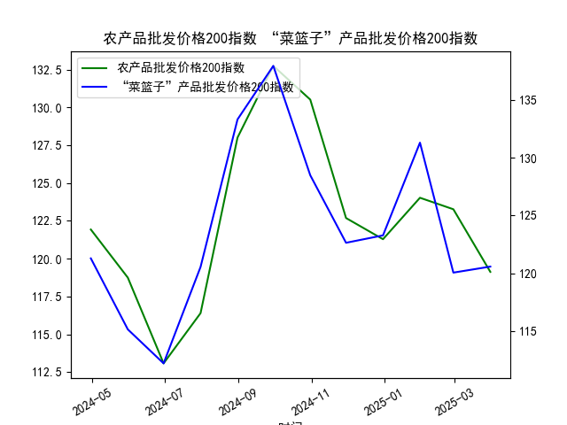

|            |   农产品批发价格200指数 |   “菜篮子”产品批发价格200指数 |
|:-----------|------------------------:|------------------------------:|
| 2024-04-30 |                  121.93 |                        121.29 |
| 2024-05-31 |                  118.75 |                        115.15 |
| 2024-06-30 |                  113.08 |                        112.21 |
| 2024-07-31 |                  116.4  |                        120.55 |
| 2024-08-31 |                  128.01 |                        133.31 |
| 2024-09-30 |                  132.75 |                        137.94 |
| 2024-10-31 |                  130.52 |                        128.48 |
| 2024-11-30 |                  122.69 |                        122.64 |
| 2024-12-31 |                  121.29 |                        123.28 |
| 2025-01-31 |                  124.03 |                        131.3  |
| 2025-02-28 |                  123.27 |                        120.06 |
| 2025-03-31 |                  119.13 |                        120.58 |

# 农产品批发价格200指数与“菜篮子”产品批发价格200指数分析

## 1. 相关性及影响逻辑分析

### （1）相关性特征
- **高度正相关**：两类指数均反映农产品批发市场价格变动，数据中两者的波动趋势高度同步（例如同步出现峰值和低谷）。
- **波动幅度差异**：“菜篮子”指数波动性更大（如从112.21升至137.94，幅度达22.9%），因其聚焦蔬菜、肉类等生鲜产品，受短期供需冲击更敏感；农产品指数涵盖范围更广（包括谷物、经济作物等），波动相对平缓（如从113.08升至132.75，幅度17.4%）。

### （2）影响逻辑
- **产业链传导**：  
  饲料成本（农产品指数）上升 → 养殖业成本增加 → 肉类价格（菜篮子指数）上涨。  
  例如，玉米、大豆价格上涨可能推高猪肉价格。
- **季节性供需驱动**：  
  极端天气导致蔬菜减产 → 菜篮子指数短期跳升 → 带动整体农产品指数上行（如数据中菜篮子指数峰值137.94对应农产品指数峰值132.75）。
- **政策与储备调节**：  
  政府抛储平抑粮价 → 农产品指数回落 → 缓解下游食品加工成本压力 → 菜篮子指数涨幅受限。

---

## 2. 近期投资与套利机会

### （1）跨指数配对交易
- **价差回归策略**：  
  近期数据中两类指数价差呈现扩大后收敛特征（例如菜篮子指数131.3时，农产品指数124.03，价差7.27；随后价差缩至1.45）。  
  **策略**：当价差超过历史均值+1倍标准差时，做空高估指数/做多低估指数，待价差回归后平仓。
- **波动率套利**：  
  菜篮子指数波动率显著高于农产品指数，可通过期权组合（如卖出菜篮子指数波动率、买入农产品指数波动率）捕捉溢价差异。

### （2）季节性供需错配
- **短期做多机会**：  
  当前菜篮子指数从131.3快速回落至120.58（跌幅8.2%），若临近节假日消费旺季，可关注超跌品类（如数据中肉类价格跌幅可能过度反映供应恢复预期）的反弹机会。
- **跨期套利**：  
  若仓储成本较低的耐储农产品（如谷物）出现远期贴水（Contango），可买入近月合约、卖出远月合约，锁定仓储利润。

### （3）风险提示
- **政策干预风险**：需监测农产品储备投放、进口配额调整等政策信号。
- **数据频率限制**：日频数据可能掩盖日内波动细节，需结合更高频数据验证趋势。
- **流动性约束**：若缺乏直接挂钩指数的衍生品，可通过相关期货（如生猪、玉米期货）间接构建策略。