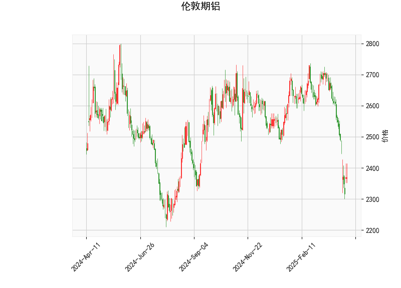

# 伦敦期铝技术分析及投资策略

---

## 一、技术分析解读

### 1. **关键指标解析**
- **当前价2370**：显著低于布林带中轨（2609.6），位于下轨（2416.4）附近，表明价格处于短期超跌区间。
- **RSI（26.23）**：严重超卖（<30），短期存在反弹修复需求。
- **MACD（-77.7） & 信号线（-55.0）**：MACD持续低于信号线且柱状图（-22.68）扩大，显示空头动能仍占主导，但超卖状态可能接近极端。
- **布林带形态**：价格贴近下轨，若持续偏离中轨则可能进入单边下跌趋势，但需警惕均值回归。
- **K线形态**：十字星（CDLDOJI、CDLLONGLEGGEDDOJI）与纺锤线（CDLSPINNINGTOP）密集出现，反映市场分歧加剧，短期可能转向震荡或反弹。

---

## 二、投资机会与策略

### 1. **短期反弹策略**
- **逻辑**：超卖（RSI<30）+价格贴近布林下轨+反转K线，短期存在技术性反弹概率。
- **操作**：
  - **多头入场**：若价格站上布林下轨（2416）且RSI回升至30以上，可轻仓试多。
  - **目标位**：中轨2609附近（约10%空间），若突破则看至2800（上轨）。
  - **止损**：跌破前低（2370）或布林下轨下移后有效破位。

### 2. **趋势跟踪策略**
- **逻辑**：MACD空头信号未反转，若价格持续承压中轨则可能延续下跌。
- **操作**：
  - **空头加仓信号**：若反弹至中轨2609附近受阻且MACD未金叉，可追加空单。
  - **目标位**：下轨动态下移后的新低区域（可能低于2300）。
  - **止损**：MACD金叉或价格突破中轨并站稳。

### 3. **套利机会**
- **跨期套利**：
  - **逻辑**：极端超卖可能引发近月合约反弹强于远月。
  - **操作**：做多近月合约+做空远月合约，价差收敛时平仓。
- **波动率套利**：
  - **逻辑**：布林带收窄后可能扩大波动，利用期权组合（如跨式策略）捕捉突破。

---

## 三、风险提示
- **趋势惯性风险**：MACD未现底背离，若大宗商品整体走弱，可能继续破位下行。
- **假突破风险**：十字星形态需配合成交量确认，警惕诱多陷阱。
- **宏观扰动**：美联储政策、地缘冲突或库存数据可能加剧价格波动。

---

**结论**：短期以超跌反弹思路轻仓试多，严格止损；中期需等待MACD金叉或价格站稳中轨后再加大仓位。套利策略建议关注跨期价差回归及波动率扩张机会。