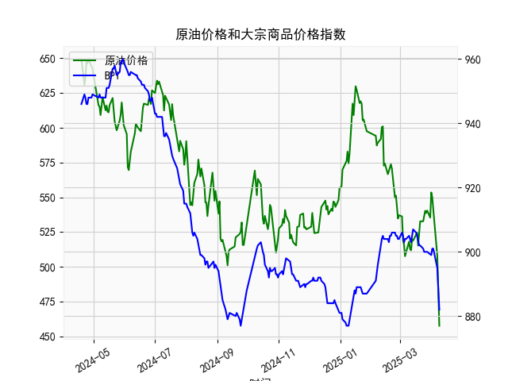

|            |   原油价格 |   大宗商品价格指数BPI |
|:-----------|-----------:|----------------------:|
| 2025-03-12 |    511.813 |                   903 |
| 2025-03-13 |    519.681 |                   905 |
| 2025-03-14 |    518.827 |                   907 |
| 2025-03-17 |    522.677 |                   906 |
| 2025-03-18 |    524.472 |                   905 |
| 2025-03-19 |    515.257 |                   903 |
| 2025-03-20 |    525.342 |                   902 |
| 2025-03-21 |    532.653 |                   902 |
| 2025-03-24 |    532.727 |                   901 |
| 2025-03-25 |    536.903 |                   900 |
| 2025-03-26 |    540.284 |                   900 |
| 2025-03-27 |    538.701 |                   900 |
| 2025-03-28 |    540.441 |                   900 |
| 2025-03-31 |    535.328 |                   899 |
| 2025-04-01 |    553.476 |                   899 |
| 2025-04-02 |    550.01  |                   901 |
| 2025-04-03 |    540.227 |                   901 |
| 2025-04-07 |    507.76  |                   895 |
| 2025-04-08 |    478.366 |                   890 |
| 2025-04-09 |    457.531 |                   882 |

### 1. 原油价格与大宗商品价格指数的相关性及影响逻辑

#### （1）相关性分析
原油价格与大宗商品价格指数通常呈现**正相关性**，但具体关联强度受以下因素影响：
- **直接传导**：原油是工业生产和运输的核心能源，其价格上涨会推高其他大宗商品（如化工品、金属）的生产和运输成本，间接带动整体大宗商品指数上行。
- **需求联动**：全球经济复苏或衰退预期会同时影响原油和工业金属等大宗商品的需求，导致二者价格同向波动。例如，2023年原油价格从约**650元/桶下跌至457元/桶**，同期大宗商品指数从**946点跌至882点**，均反映需求疲软。
- **金融属性**：两者均受美元走势、通胀预期和投机资金流动影响。美元走强时，以美元计价的大宗商品价格承压，反之则可能反弹。

#### （2）影响逻辑分歧点
- **供给端差异**：原油供给受地缘政治（如OPEC+减产）和季节性因素（如炼厂检修）扰动更显著，而农产品等大宗商品更多受天气和种植周期影响。
- **替代效应**：原油价格过高可能加速新能源替代（如电动车普及），但对其他大宗商品的需求拉动可能边际减弱。

---

### 2. 近期投资或套利机会与策略

#### （1）趋势性机会
- **原油超跌反弹**：近期原油价格从最低**457元/桶反弹至570-600元/桶**，而大宗商品指数仍处于低位（**882点**）。若经济复苏预期强化，可关注**原油多单+大宗商品指数期货多单**的组合策略。
- **裂解价差套利**：若原油涨幅快于下游化工品（如乙烯、PTA），可通过做多原油期货、做空化工品期货，捕捉炼厂利润收窄的套利窗口。

#### （2）背离修复机会
- **原油与指数的短期背离**：数据末期原油反弹但指数未同步回升，若判断为短期情绪扰动，可建立**多原油期货+空大宗商品指数期货**的对冲组合，待价差收敛后平仓。
- **跨品种套利**：若观察到原油与农产品（如大豆）价格因季节性因素反向波动，可通过多空配对交易捕捉价差回归。

#### （3）风险提示
- **地缘政治风险**：原油供给端易受突发事件冲击（如中东冲突），需设置严格止损。
- **流动性波动**：美联储货币政策转向可能引发美元和商品价格的剧烈波动，需动态调整仓位。