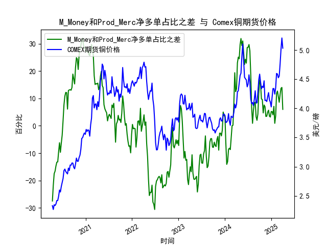

|            |   M_Money净多单占比 |   Prod_MercM_Money净多单占比 |   Comex铜期货价格 |   M_Money和Prod_Merc净多单占比之差 |
|:-----------|--------------------:|-----------------------------:|------------------:|-----------------------------------:|
| 2024-11-19 |                35.9 |                         39.3 |            4.142  |                                3.4 |
| 2024-11-26 |                37.3 |                         40.8 |            4.1185 |                                3.5 |
| 2024-12-03 |                35.6 |                         40.6 |            4.202  |                                5   |
| 2024-12-10 |                34.9 |                         40.6 |            4.272  |                                5.7 |
| 2024-12-17 |                35.8 |                         39.3 |            4.1465 |                                3.5 |
| 2024-12-24 |                35.7 |                         38.9 |            4.11   |                                3.2 |
| 2024-12-31 |                35   |                         40.2 |            4.0265 |                                5.2 |
| 2025-01-07 |                35.8 |                         41   |            4.1955 |                                5.2 |
| 2025-01-14 |                36.6 |                         40.6 |            4.3425 |                                4   |
| 2025-01-21 |                33.8 |                         40.9 |            4.341  |                                7.1 |
| 2025-01-28 |                36.1 |                         37   |            4.2465 |                                0.9 |
| 2025-02-04 |                35.5 |                         39.1 |            4.3535 |                                3.6 |
| 2025-02-11 |                30.8 |                         42.6 |            4.601  |                               11.8 |
| 2025-02-18 |                29.9 |                         42.6 |            4.591  |                               12.7 |
| 2025-02-25 |                30.7 |                         41.3 |            4.5275 |                               10.6 |
| 2025-03-04 |                32.1 |                         40.7 |            4.5565 |                                8.6 |
| 2025-03-11 |                30.3 |                         41.8 |            4.766  |                               11.5 |
| 2025-03-18 |                28.8 |                         42.5 |            5.0165 |                               13.7 |
| 2025-03-25 |                28.1 |                         42.1 |            5.2105 |                               14   |
| 2025-04-01 |                32.4 |                         38.4 |            5.035  |                                6   |

### 1. M_Money和Prod_Merc净多单占比之差与Comex铜期货价格的相关性及影响逻辑

#### （1）指标定义与市场角色
- **M_Money（非商业多头持仓）**：主要由投机资金（如对冲基金、资管机构）构成，反映市场情绪和短期价格预期。
- **Prod_Merc（商业多头持仓）**：代表实体企业（如矿商、贸易商）的套期保值行为，反映产业链对价格的长期判断。

两者的净多单占比之差（M_Money - Prod_Merc）可视为**投机资金与产业资本的博弈结果**：
- **差值为正**：投机资金看多意愿强于产业资本，可能推动价格上涨。
- **差值为负**：产业资本套保需求强于投机看多，可能压制价格。

#### （2）历史相关性分析
从近5年数据看，两者的差值变化与铜价呈现**强正相关性**：
- **差值扩张阶段**（如差值从-30升至+30）：铜价从2.3美元/磅涨至5.2美元/磅（2020-2022年），投机资金主导的流动性推升价格。
- **差值收缩阶段**（如2023年差值回落至-20以下）：铜价从4.7美元/磅回调至3.6美元/磅，产业套保和宏观紧缩抑制投机情绪。

#### （3）影响逻辑
- **投机资金主导短期波动**：M_Money占比上升时，铜价对流动性敏感（如美联储政策、通胀预期）。
- **产业资本锚定长期供需**：Prod_Merc占比上升时，铜价受库存周期、中国需求等基本面主导。
- **极端差值预示反转**：当差值达到历史极值（如+30或-30），可能触发多空力量反转。

---

### 2. 近期投资或套利机会与策略

#### （1）当前市场信号
- **最新数据**：差值近期从-20回升至-10附近，铜价从3.6反弹至4.5美元/磅（2023年末）。
- **隐含矛盾**：投机资金开始回流（差值回升），但产业资本套保仍谨慎（差值仍为负），反映市场对经济复苏的犹豫。

#### （2）潜在机会与策略
##### **机会1：趋势跟随（多头策略）**
- **逻辑**：若差值持续回升且铜价突破4.5美元/磅，可能开启新一轮上涨。
- **策略**：做多Comex铜期货，止损设于4.3美元以下，目标看向历史高点5.2美元。

##### **机会2：均值回归（空头策略）**
- **逻辑**：若差值回升至0附近后停滞，且铜价触及4.8-5.0美元阻力区，可博弈回调。
- **策略**：逢高做空期货，或买入看跌期权，止损设于5.0美元上方。

##### **机会3：跨期套利**
- **逻辑**：近期铜价反弹但远月贴水（Contango）结构未改，反映市场对长期供应的担忧。
- **策略**：做空近月合约（如3个月到期），做多远月合约（如12个月到期），赚取展期收益。

##### **机会4：波动率交易**
- **逻辑**：当前铜价处于宏观敏感期（美联储政策、中国刺激政策），隐含波动率可能上升。
- **策略**：买入跨式期权组合（同时买入看涨和看跌期权），押注价格突破或事件驱动波动。

#### （3）风险提示
- **宏观风险**：美联储加息周期尾部可能引发流动性收紧。
- **供需风险**：南美铜矿罢工、中国新能源需求不及预期可能打破平衡。
- **持仓结构风险**：若差值再度转负，需警惕产业资本套保抛压。