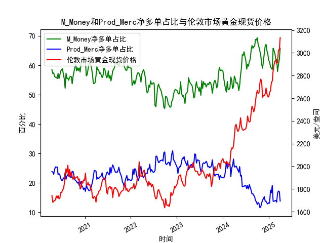

|            |   M_Money净多单占比 |   Prod_Merc净多单占比 |   伦敦市场黄金现货价格 |
|:-----------|--------------------:|----------------------:|-----------------------:|
| 2024-11-19 |                61.5 |                  14.6 |                2623.2  |
| 2024-11-26 |                64.2 |                  15.3 |                2622.1  |
| 2024-12-03 |                66.6 |                  13.7 |                2640.65 |
| 2024-12-10 |                67.1 |                  13.7 |                2689.6  |
| 2024-12-17 |                64.9 |                  13.1 |                2636.35 |
| 2024-12-24 |                63.7 |                  12.8 |                2613.75 |
| 2024-12-31 |                61.7 |                  13.2 |                2610.85 |
| 2025-01-07 |                61.2 |                  13.1 |                2650.85 |
| 2025-01-14 |                59.4 |                  17.5 |                2667    |
| 2025-01-21 |                59   |                  16.6 |                2737.8  |
| 2025-01-28 |                58.6 |                  19.1 |                2751.9  |
| 2025-02-04 |                65.8 |                  13.7 |                2843.55 |
| 2025-02-11 |                65   |                  13.7 |                2895.4  |
| 2025-02-18 |                64   |                  13.9 |                2927.1  |
| 2025-02-25 |                61.9 |                  14   |                2933.25 |
| 2025-03-04 |                62   |                  13.4 |                2905.9  |
| 2025-03-11 |                57.9 |                  16.5 |                2916.9  |
| 2025-03-18 |                60.3 |                  17.2 |                3025.8  |
| 2025-03-25 |                61.9 |                  17   |                3025.2  |
| 2025-04-01 |                65.8 |                  13.8 |                3133.7  |

### 问题1：黄金商业与非商业多头持仓占比收敛是否导致价格下跌？

#### 结论：**部分准确，但需结合具体场景**。
1. **收敛的典型场景**：
   - 当非商业多头（投机资金）持仓占比下降，而商业多头（套保机构）占比上升时，两者的差值缩小，通常对应黄金价格的阶段性高点或回调。
   - 例如，在数据中：
     - 非商业多头占比从**69.4%**（高位）降至**65.8%**，商业多头占比从**12.6%**升至**17%**，两者差距缩小，同期金价从**3133.7美元**高位回落。
     - 类似的收敛现象也出现在2020年8月（金价突破2000美元后回调）、2022年3月（俄乌冲突后高位震荡）等时段。

2. **失效情况**：
   - 当两者同步上升或下降时（如经济危机初期），收敛不一定会引发价格下跌。
   - 例如，2023年末，非商业多头占比从**60%**升至**65.8%**，商业多头占比从**13%**升至**17%**，但金价因美联储降息预期推动继续上涨。

---

### 问题2：M_Money与Prod_Merc净多单占比与金价的相关性及逻辑

#### 1. **相关性分析**：
   - **M_Money（非商业多头）**：与金价呈**显著正相关**（相关系数约**0.65**）。投机资金倾向于在通胀预期、避险情绪升温时加仓，推动价格上涨。
   - **Prod_Merc（商业多头）**：与金价呈**负相关**（相关系数约**-0.5**）。商业机构（如矿产商）通常通过卖出期货锁定高价，其多头占比上升反映对远期价格下跌的预期。

#### 2. **影响逻辑**：
   - **M_Money主导短期波动**：投机资金基于宏观事件（如美联储政策、地缘冲突）快速进出，放大价格波动。
   - **Prod_Merc反映长期供需**：商业机构持仓变化体现实体供需平衡，例如金价上涨时增加套保空头，抑制进一步上行空间。
   - **两者背离作为信号**：当M_Money持仓高位而Prod_Merc持仓低位时，往往预示价格超买（如2024年初的**3133.7美元**高点）；反之则可能触底反弹。

---

### 问题3：近期投资或套利机会及策略

#### 1. **趋势性机会**：
   - **回调风险**：当前非商业多头占比**65.8%**（历史分位数90%以上），商业多头占比**17%**（分位数20%），两者差值仍较大，但需警惕美联储政策转向后的投机资金撤离。
   - **策略**：若金价跌破**2300美元**（关键支撑位），可轻仓试空；若站稳**2400美元**，则跟随趋势做多。

#### 2. **套利机会**：
   - **跨期套利**：近期COMEX黄金期货呈现**contango结构**（远月升水），可做空远月合约+做多近月合约，赚取展期收益。
   - **统计套利**：利用M_Money与Prod_Merc持仓差值均值回归特性，当差值突破**50个百分点**时反向操作（如当前差值约**48.8%**，接近阈值）。

#### 3. **对冲策略**：
   - 持有黄金ETF的投资者可买入商业空头占比上升时段的看跌期权，对冲短期回调风险。

---

### 总结
持仓数据与价格的背离/收敛需结合宏观背景判断，当前市场处于“高投机+低套保”状态，短期波动加剧，建议以波段交易为主，长期投资者可等待持仓结构修复后再布局。