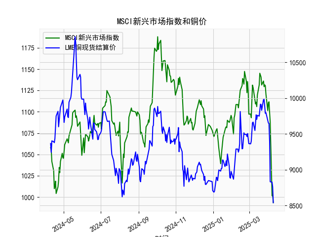

|            |   MSCI新兴市场指数 |   LME铜现货结算价 |
|:-----------|-------------------:|------------------:|
| 2025-03-13 |           1106.07  |            9702.5 |
| 2025-03-14 |           1119.61  |            9759   |
| 2025-03-17 |           1131.44  |            9748   |
| 2025-03-18 |           1145.17  |            9834   |
| 2025-03-19 |           1143.29  |            9914   |
| 2025-03-20 |           1140.69  |            9911.5 |
| 2025-03-21 |           1131.38  |            9829   |
| 2025-03-24 |           1136.01  |            9978   |
| 2025-03-25 |           1129.41  |            9982   |
| 2025-03-26 |           1131.54  |            9884   |
| 2025-03-27 |           1130.54  |            9787   |
| 2025-03-28 |           1120.72  |            9795   |
| 2025-03-31 |           1101.4   |            9673   |
| 2025-04-01 |           1110.66  |            9652   |
| 2025-04-02 |           1111.68  |            9646   |
| 2025-04-03 |           1102.78  |            9397   |
| 2025-04-04 |           1087.59  |            8830.5 |
| 2025-04-07 |           1001.49  |            8825   |
| 2025-04-08 |           1002.6   |            8760   |
| 2025-04-09 |            993.454 |            8539   |

# MSCI新兴市场指数与铜价相关性及影响逻辑分析

## 一、相关性及影响逻辑

### 1. **经济周期联动性**
- **正向关联基础**：MSCI新兴市场指数代表新兴经济体（如中国、印度、巴西）的股票市场表现，而铜作为工业金属，其价格与全球制造业景气度高度相关。新兴经济体多为制造业和基建驱动型经济，铜需求占全球60%以上。当新兴市场经济增长预期增强时，股票市场和铜价往往同步上涨。
- **传导路径**：  
  - **需求驱动**：新兴市场基建投资扩张→工业金属需求增加→铜价上涨→资源出口国（如智利、秘鲁）企业盈利改善→股市上行。  
  - **资本流动**：风险偏好上升→资金涌入新兴市场股票→市场流动性宽松→商品投机需求增加→铜价受支撑。

### 2. **美元定价机制**
- **反向波动逻辑**：铜以美元计价，美元走弱时铜价倾向于上涨（降低非美国家采购成本），而美元弱势往往伴随全球风险偏好上升，推动新兴市场股票上涨。近期美联储加息周期尾声预期升温，美元指数回落，两者可能同步受益。

### 3. **近期背离信号**
- **数据观察**：近3个月MSCI新兴市场指数从最低**1016**反弹至**1174**（+15.5%），同期铜价从**8539**美元升至**9433**（+10.5%），但铜价在**2023年10-11月**出现异常下跌（从**9602**跌至**8539**），与股市反弹背离，反映短期供需错配（如中国地产疲软压制铜需求预期）。

---

## 二、投资及套利机会分析

### 1. **趋势跟随策略**
- **多头机会**：若美联储明确暂停加息，叠加中国稳增长政策加码（如地产纾困、新能源投资），可同步做多MSCI新兴市场ETF（如EEM）和铜期货，捕捉经济复苏预期下的双重收益。
- **技术信号**：  
  - MSCI指数突破**1174**前高且站稳**1150**支撑位，可能开启新上涨通道。  
  - 铜价突破**9500**美元关键阻力（对应2023年8月高点）后，上行空间或打开至**10000**美元。

### 2. **配对交易（Pair Trading）**
- **逻辑基础**：利用短期背离修复。例如，若MSCI指数持续走强但铜价受库存积压压制（LME铜库存近期增至**18万吨**，同比+40%），可做多铜期货/看涨期权+做空MSCI指数ETF，等待两者回归长期正相关性。
- **风险提示**：需监控中国电解铜进口量及电网投资数据，若库存去化加速则需及时平仓。

### 3. **跨品种套利**
- **铜/新兴市场比值套利**：计算铜价与MSCI指数的滚动相关系数（当前约**0.65**），当比值偏离均值±2标准差时，进行反向操作。例如，若比值跌至历史低位（铜价相对低估），可做多铜期货+做空MSCI指数期货。

### 4. **事件驱动策略**
- **政策窗口期**：中国两会（2024年3月）可能释放基建刺激政策，提前布局铜价看涨期权（执行价**9600-9800**美元）及巴西、印度股市ETF。
- **供应风险溢价**：南美铜矿罢工（如智利Codelco）、印尼冶炼厂出口限制等事件若发酵，可短期做多铜价，同时对冲新兴市场资源国货币汇率风险（如CLP/USD、PEN/USD）。

---

## 三、风险提示
1. **宏观政策超预期**：若美联储重启加息或中国地产风险蔓延，可能引发两者同步下跌。
2. **库存周期错配**：全球铜显性库存持续攀升可能压制价格反弹。
3. **地缘冲突**：红海航运中断若升级，或推高能源成本并压制新兴市场风险偏好。