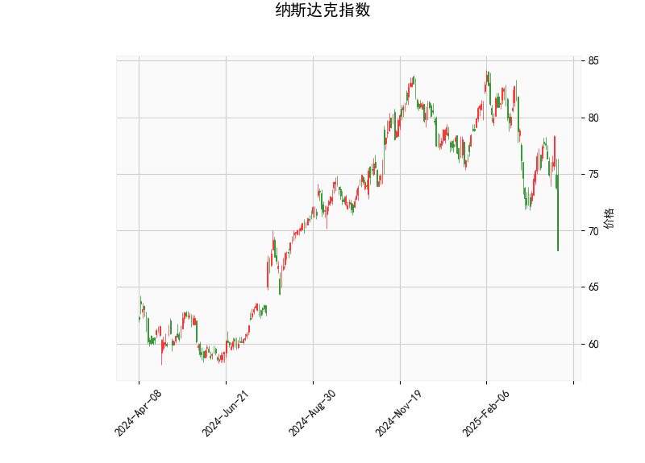

### 纳斯达克指数技术分析结果解读

#### 1. 技术指标综合分析
（1）**RSI（相对强弱指数）**  
当前RSI值为**31.17**，接近超卖阈值（通常30以下为超卖区域），表明市场短期可能处于**超卖状态**，存在反弹修复的可能性。但需注意，RSI未跌破30可能暗示空头动能尚未完全释放。

（2）**MACD指标**  
- MACD线（-1.16）低于信号线（-0.81），且柱状图（-0.36）为负值，显示**空头占优**，短期下跌动能仍在延续。  
- 但MACD与信号线均处于负值区间，若后续出现柱状图缩窄或金叉，可能预示短期止跌。

（3）**布林轨道**  
- 当前价（68.25）**显著低于布林下轨（71.45）**，偏离幅度达**4.4%**，属于极端超卖信号。历史数据中，价格突破布林带下轨后常伴随均值回归。  
- 中轨（78.17）与当前价的差距高达**12.8%**，显示中期趋势偏弱，但短期存在超跌反弹需求。

（4）**K线形态**  
- **CDLCLOSINGMARUBOZU**（光头光脚阳线）通常为**看涨反转信号**，表明当前价格波动中买方开始占据主导，若出现在超卖区域，可能强化反弹预期。

---

#### 2. 投资机会与策略建议

**（1）短期波段交易机会**  
- **看多策略**：  
  - **触发条件**：价格回升至布林下轨（71.45）上方且RSI突破40。  
  - **目标**：中轨（78.17）附近，潜在收益约**12%**。  
  - **止损**：跌破前低（假设68.25为近期低点）或RSI再度跌破30。  

- **套利策略**：  
  - **期现套利**：若股指期货贴水扩大（期货价格低于现货），可做多期货+做空现货组合，捕捉基差收敛收益。  
  - **波动率交易**：当前价格偏离布林带幅度较大，可卖出看跌期权（Short Put）收取权利金，但需防范极端行情风险。

**（2）中期风险提示**  
- **空头趋势未逆转**：MACD仍处于负值区域，中轨（78.17）与上轨（84.90）构成强阻力，反弹后可能再度承压。  
- **流动性风险**：若市场情绪恶化导致持续破位下跌，需警惕流动性收缩引发的加速下行。

**（3）操作建议**  
- **保守投资者**：等待MACD金叉（柱状图转正）+价格站稳中轨后再介入。  
- **激进投资者**：在68-71区间分批建仓，反弹至75-78区间逐步止盈。

---

### 关键结论
当前技术面呈现**短期超卖反弹与中期弱势并存**的特征，建议以**左侧交易（逢低布局）**为主，但需严格设置止损并关注美联储政策、通胀数据等宏观变量对市场的冲击。