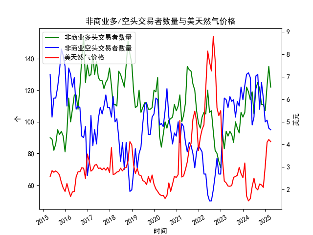

|            |   非商业多头交易者数量 |   非商业空头交易者数量 |   美天然气价格 |
|:-----------|-----------------------:|-----------------------:|---------------:|
| 2023-08-31 |                    100 |                    103 |           2.58 |
| 2023-09-30 |                     96 |                    113 |           2.64 |
| 2023-10-31 |                     93 |                    110 |           2.99 |
| 2023-11-30 |                    106 |                    122 |           2.71 |
| 2023-12-31 |                    103 |                    114 |           2.53 |
| 2024-01-31 |                    106 |                    123 |           3.18 |
| 2024-02-29 |                    122 |                    130 |           1.72 |
| 2024-03-31 |                    119 |                    131 |           1.5  |
| 2024-04-30 |                    114 |                    128 |           1.6  |
| 2024-05-31 |                    119 |                     98 |           2.13 |
| 2024-06-30 |                    105 |                    103 |           2.51 |
| 2024-07-31 |                    121 |                    129 |           2.08 |
| 2024-08-31 |                    125 |                    130 |           1.99 |
| 2024-09-30 |                    121 |                    108 |           2.25 |
| 2024-10-31 |                    111 |                    125 |           2.21 |
| 2024-11-30 |                    111 |                    115 |           2.1  |
| 2024-12-31 |                    107 |                    100 |           3.02 |
| 2025-01-31 |                    123 |                    101 |           4.1  |
| 2025-02-28 |                    135 |                     96 |           4.22 |
| 2025-03-31 |                    122 |                     95 |           4.13 |

### 近期美天然气市场套利机会及策略分析

根据提供的近10年NYMEX交易所美天然气非商业持仓数据和价格数据，以下为潜在的套利机会及策略：

---

#### 1. **跨期套利（Calendar Spread）**
   - **背景**：2025年1月至3月天然气价格快速上涨（4.10→4.22→4.13），但同期多头持仓量在2月达到峰值（135个）后回落至122个。价格与持仓量出现短期背离。
   - **机会**：若近期价格因持仓量减少而回调，而远月合约（如2025年夏季）受季节性需求预期支撑，可做空近月合约（如2025年3月）、做多远月合约。
   - **风险**：需验证远月合约是否隐含季节性升水，并关注库存数据对供需的影响。

---

#### 2. **持仓反转策略**
   - **背景**：2025年2月多头持仓达135个（近10年高点），随后3月价格小幅回落。历史规律显示，极端持仓量常伴随价格反转。
   - **策略**：
     - **多头平仓信号**：当持仓量创历史新高且价格高位滞涨时，逐步平仓多头或建立空头头寸。
     - **空头回补机会**：若空头持仓（未展示数据）同步骤减，可能加速价格反弹。

---

#### 3. **季节性价差交易**
   - **季节性特征**：天然气价格通常在冬季（12月-2月）因取暖需求上涨，春季（3月-4月）回落。2024年12月至2025年2月价格从3.02涨至4.22，3月回调至4.13，符合季节性规律。
   - **策略**：
     - **做空春季合约，做多秋季合约**：利用3月价格回落预期，同时押注秋季需求回升（如工业用气增加）。
     - **风险**：需结合天气预报和库存水平调整头寸，极端天气可能打破季节性规律。

---

#### 4. **波动率套利**
   - **背景**：2025年初价格波动加剧（3.02→4.22），持仓量同步波动。隐含波动率可能高于历史平均水平。
   - **策略**：
     - **卖出期权策略**：若波动率处于高位，可卖出跨式期权（Sell Straddle），押注价格进入盘整阶段。
     - **风险**：需防范地缘政治或供应中断事件引发的暴涨暴跌。

---

#### 5. **多空持仓比率背离策略**
   - **假设**：若空头持仓（S0108023）在价格快速上涨时同步增加，可能反映市场分歧加大，价格面临反转压力。
   - **操作**：计算多空持仓比率（需空头数据），当比率极端偏离均值时反向操作。

---

### 关键风险提示
1. **数据局限性**：空头持仓数据未明确展示，需验证多空力量对比。
2. **外部冲击**：地缘冲突、极端天气或政策变化（如碳中和政策）可能打破历史规律。
3. **流动性风险**：远月合约交易量较低时，跨期套利成本可能上升。

---

### 结论
近期重点关注**跨期价差收敛**和**持仓反转信号**，优先选择流动性充足的合约，并动态跟踪库存报告及天气预测以优化策略。