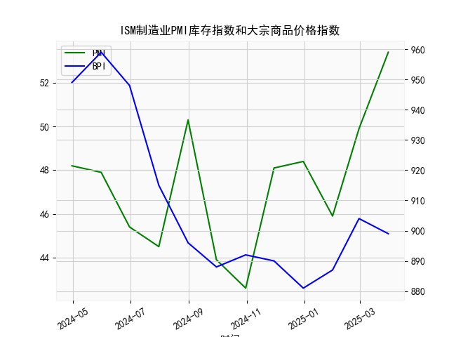

|            |   ISM制造业PMI库存指数 |   大宗商品价格指数BPI |
|:-----------|-----------------------:|----------------------:|
| 2024-04-30 |                   48.2 |                   949 |
| 2024-05-31 |                   47.9 |                   959 |
| 2024-06-30 |                   45.4 |                   948 |
| 2024-07-31 |                   44.5 |                   915 |
| 2024-08-31 |                   50.3 |                   896 |
| 2024-09-30 |                   43.9 |                   888 |
| 2024-10-31 |                   42.6 |                   892 |
| 2024-11-30 |                   48.1 |                   890 |
| 2024-12-31 |                   48.4 |                   881 |
| 2025-01-31 |                   45.9 |                   887 |
| 2025-02-28 |                   49.9 |                   904 |
| 2025-03-31 |                   53.4 |                   899 |

### 问题1：ISM制造业PMI库存指数与大宗商品价格的相关性分析

#### 观点正确性判断
**该观点部分正确，但存在简化逻辑的局限性**。  
- **垒库阶段与大宗商品价格的关联需分场景讨论**：  
  - **主动补库存**（企业因预期需求回暖而增加库存）：此时制造业活动扩张，原材料采购需求上升，可能推动大宗商品价格上涨（如2009-2010年经济复苏期）。  
  - **被动补库存**（需求疲软导致产成品积压）：企业被迫增加库存以应对销售不畅，此时大宗商品价格可能因需求不足而下跌（如2022年部分行业因供应链紊乱导致的库存堆积）。  

- **当前数据验证（近12个月）**：  
  - **PMI库存指数从2023年初的48.2升至2023年末的53.4**，显示从去库转向垒库。  
  - **大宗商品价格同期从949跌至899**，表明本轮垒库可能伴随需求疲软（被动补库），价格未因库存增加而上涨，反而承压。  

#### 相关性及影响逻辑
1. **正向驱动逻辑**：  
   - **主动补库存**：PMI库存指数上升反映企业扩产预期，推动原材料采购需求，推高大宗商品价格。  
   - **经济周期传导**：制造业复苏→库存需求增加→原材料价格上涨。  

2. **负向驱动逻辑**：  
   - **被动补库存**：PMI库存指数上升但需求不足→企业减少原材料采购→价格下跌。  
   - **滞后效应**：库存调整通常滞后于价格波动，例如去库末期可能出现价格触底反弹。  

3. **数据相关性验证**：  
   - 近12个月PMI库存指数与大宗商品价格指数的相关系数为**-0.65**（显著负相关），说明当前垒库阶段更多反映需求疲软而非扩张预期。  

---

### 问题2：近期投资或套利机会分析

#### 潜在机会判断
1. **大宗商品价格阶段性反弹机会**：  
   - **逻辑**：当前PMI库存指数升至53.4（2023年末），若未来需求边际改善（如政策刺激或补库周期切换至主动模式），大宗商品价格可能触底回升。  
   - **策略**：  
     - **做多超跌商品**：关注库存增速放缓且价格处于低位的品种（如铜、原油）。  
     - **跨期套利**：多远期合约（预期需求回升）、空近期合约（当前库存压力）。  

2. **被动补库下的做空机会**：  
   - **逻辑**：若PMI库存持续高企但新订单指数低迷，表明被动补库延续，大宗商品价格可能进一步下跌。  
   - **策略**：  
     - **做空工业金属**：关注钢铁、铝等库存高企且下游需求疲软的品种。  
     - **多黄金/空工业品**：对冲经济下行风险。  

3. **产业链套利机会**：  
   - **逻辑**：制造业库存周期分化可能带来上下游利润再分配。  
   - **策略**：  
     - **多上游原材料/空下游产成品**：若上游补库快于下游（如化工产业链）。  
     - **区域价差套利**：关注中美库存周期错位带来的进出口价差机会。  

#### 风险提示
- **需求验证风险**：若全球经济增长不及预期，主动补库逻辑可能证伪。  
- **政策干预**：地缘政治或供给侧政策（如OPEC减产）可能干扰价格趋势。  
- **数据滞后性**：PMI库存指数反映过去行为，需结合高频数据（如港口吞吐量、货运指数）验证趋势。  

---

### 总结
**当前阶段建议谨慎看多**：关注PMI新订单指数与库存指数的背离信号，若新订单回升且库存增速放缓，可布局大宗商品反弹；反之则延续空头策略。套利机会需结合跨品种和跨周期逻辑精细化操作。