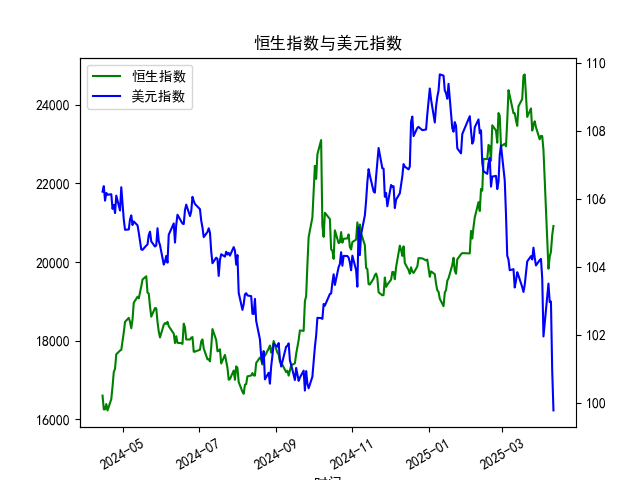

|            |   恒生指数 |   美元指数 |
|:-----------|-----------:|-----------:|
| 2025-03-14 |    23960   |    103.736 |
| 2025-03-17 |    24145.6 |    103.399 |
| 2025-03-18 |    24740.6 |    103.254 |
| 2025-03-19 |    24771.1 |    103.463 |
| 2025-03-20 |    24220   |    103.817 |
| 2025-03-21 |    23689.7 |    104.154 |
| 2025-03-24 |    23905.6 |    104.307 |
| 2025-03-25 |    23344.2 |    104.21  |
| 2025-03-26 |    23483.3 |    104.559 |
| 2025-03-27 |    23578.8 |    104.26  |
| 2025-03-28 |    23426.6 |    104.034 |
| 2025-03-31 |    23119.6 |    104.192 |
| 2025-04-01 |    23206.8 |    104.226 |
| 2025-04-02 |    23202.5 |    103.661 |
| 2025-04-03 |    22849.8 |    101.945 |
| 2025-04-07 |    19828.3 |    103.501 |
| 2025-04-08 |    20127.7 |    102.956 |
| 2025-04-09 |    20264.5 |    102.971 |
| 2025-04-10 |    20681.8 |    100.937 |
| 2025-04-11 |    20914.7 |     99.769 |

### 问题1：恒生指数与美元指数的相关性及影响逻辑

恒生指数与美元指数呈现**负相关性**，其核心逻辑源于以下几个方面：

1. **资本流动效应**：
   - 美元指数走强时，全球资本倾向于回流美元资产（如美债、美股），导致新兴市场（包括港股）流动性减少，恒生指数承压。
   - 美元指数走弱时，资金可能从美元资产转向估值较低的新兴市场，推动恒生指数上涨。

2. **汇率挂钩机制**：
   - 港币与美元实行联系汇率制度，美元升值会间接抬高港股以其他货币（如人民币、欧元）计价资产的相对成本，抑制外资流入港股市场。

3. **企业盈利传导**：
   - 恒指成分股中许多企业（如金融、地产、出口贸易）的营收和负债与美元汇率密切相关。美元升值可能增加外债成本或压缩出口利润，拖累股价。

4. **风险情绪联动**：
   - 美元指数常被视为避险资产，当全球风险偏好下降（如地缘冲突、经济衰退预期）时，美元与恒生指数同步性可能减弱，但长期仍以负相关为主。

---

### 问题2：近期投资或套利机会与策略分析

#### 当前市场特征：
1. **美元指数趋势**：
   - 从提供的美元指数数据看，近期美元指数从高位（109.65）回落至99.76，技术面呈现下行趋势，可能反映美联储加息周期接近尾声的预期。
   
2. **人民币贷款-存款增速差**：
   - 贷款增速持续高于存款增速（差值从16,600升至20,914），显示国内信贷扩张政策发力，流动性宽松环境利好港股（尤其是金融、地产板块）。

#### 潜在机会与策略：
1. **做多恒生指数**：
   - **逻辑**：美元走弱+国内流动性宽松的双重支撑下，恒生指数可能延续反弹。可关注恒指ETF（如盈富基金）或成分股中弹性较大的板块（科技、消费）。
   - **风险**：需警惕美国通胀反复或地缘政治事件导致美元指数反弹。

2. **跨市场套利**：
   - **港股与A股价差收敛**：通过沪港通/深港通买入相对低估的港股（如H股较A股折价较大的金融股），同时做空对应的A股。
   - **汇率对冲策略**：若预期港币兑美元维持稳定，可借入低息美元，兑换为港币投资高股息港股，赚取利差和资本增值。

3. **行业轮动机会**：
   - **高外债敏感板块**：美元走弱利好航空（燃油成本下降）、地产（外债压力缓解）等板块。
   - **人民币资产重估**：国内信贷扩张可能推动在港上市的中资银行、券商股估值修复。

#### 风险提示：
- **美元指数反弹**：若美国经济数据超预期或地缘风险升温，美元可能短期走强，压制港股。
- **国内政策效果滞后**：信贷扩张向实体经济传导需时间，需关注后续PMI、社融数据验证。

---

### 结论：
短期可围绕“美元弱+信贷松”逻辑布局恒指多头，中期需跟踪美联储政策转向节奏及国内经济复苏力度。套利策略建议以低风险对冲为主，避免单边敞口过大。