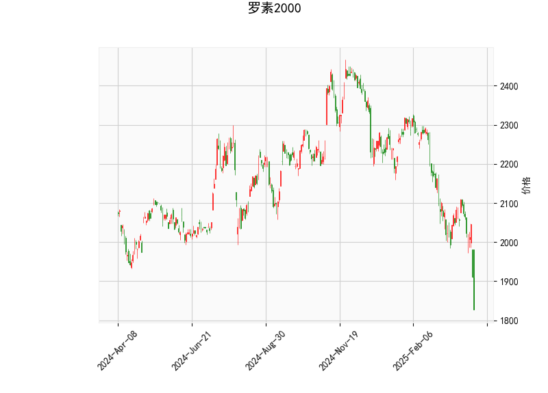

### 罗素2000指数技术分析结果解读

#### 1. 技术指标分析
- **当前价与布林带**  
  当前价（**1827.032**）显著低于布林带下轨（**1917.47**），且中轨（**2157.54**）与下轨之间的价差较大，表明市场处于极度超卖状态。价格突破下轨通常预示短期可能反弹或进入整理阶段，但需结合其他指标确认。

- **RSI（24.26）**  
  RSI已进入超卖区域（低于30），显示短期卖压过度释放，但需注意超卖可能持续（如熊市中的长期下跌）。若RSI回升至30以上，可能触发技术性反弹。

- **MACD（-55.04）与信号线（-41.22）**  
  MACD线位于信号线下方且持续下行，柱状图（-13.82）负值扩大，表明下跌动能仍在增强。若未来柱状图缩窄（负值减小），可能预示跌势放缓。

- **K线形态**  
  - **CDLBELTHOLD**：多空博弈信号，需结合趋势判断方向。  
  - **CDLCLOSINGMARUBOZU**（收盘光头线）：显示当前趋势（下跌）占优。  
  - **CDLLONGLINE**（长实体线）：反映市场犹豫，但空头仍主导。  
  - **CDLMARUBOZU**（光头光脚线）：强化短期下跌趋势的延续性。

#### 2. 投资机会与策略建议

##### **短期机会：超跌反弹**  
- **条件触发**：若价格回升至布林带下轨（1917）上方，或RSI反弹至30以上，可能确认短期底部。  
- **策略**：  
  - **左侧交易**：轻仓试多，止损位设于近期低点下方（如1800）。  
  - **右侧交易**：等待MACD柱状图缩窄或金叉信号（MACD线上穿信号线）。  
  - **目标**：布林带中轨（2157）附近，潜在空间约18%。

##### **中期风险与对冲**  
- **下行风险**：MACD持续下行可能引发进一步破位，若跌破1800关口，或打开更大下跌空间。  
- **对冲策略**：  
  - **买入看跌期权**：保护多头头寸或押注续跌。  
  - **多空配对**：做多罗素2000指数ETF（如IWM）同时做空标普500指数，押注小盘股相对大盘补涨。

##### **套利机会：波动率交易**  
- **逻辑**：价格偏离布林带下轨过远，隐含波动率可能上升。  
- **策略**：  
  - **跨式期权组合**：同时买入平值看涨和看跌期权，押注价格波动加剧。  
  - **日历价差**：卖出短期看跌期权+买入长期看跌期权，利用时间差捕捉反弹。

#### 3. 关键注意事项  
- **基本面验证**：需结合美国小盘股盈利预期、利率政策及经济数据（如就业、PMI）判断趋势持续性。  
- **仓位管理**：超卖反弹属于高风险操作，建议仓位不超过总资金的5%-10%。  
- **时间窗口**：若反弹未在1-2周内启动，需警惕市场情绪进一步恶化。

**结论**：当前技术面呈现超卖，但趋势仍偏空，短期可轻仓博弈反弹，中期需等待MACD或价格结构反转信号。