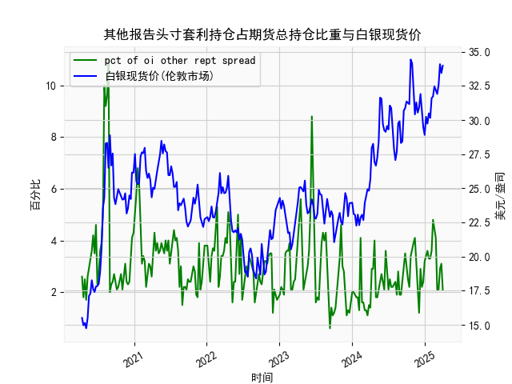

|            |   其他报告头寸套利持仓占期货总持仓比重 |   白银现货价 |
|:-----------|---------------------------------------:|-------------:|
| 2024-11-19 |                                    3   |       31.285 |
| 2024-11-26 |                                    2.2 |       30.54  |
| 2024-12-03 |                                    1.2 |       30.905 |
| 2024-12-10 |                                    2.9 |       31.9   |
| 2024-12-17 |                                    2.2 |       30.31  |
| 2024-12-24 |                                    2.4 |       29.48  |
| 2024-12-31 |                                    3.2 |       28.905 |
| 2025-01-07 |                                    3.4 |       30.235 |
| 2025-01-14 |                                    3.6 |       29.735 |
| 2025-01-21 |                                    3.3 |       30.485 |
| 2025-01-28 |                                    3.3 |       30.15  |
| 2025-02-04 |                                    3.6 |       31.595 |
| 2025-02-11 |                                    4.8 |       31.73  |
| 2025-02-18 |                                    4.5 |       32.46  |
| 2025-02-25 |                                    4.1 |       32.145 |
| 2025-03-04 |                                    2.1 |       31.905 |
| 2025-03-11 |                                    2.1 |       32.55  |
| 2025-03-18 |                                    2.9 |       34.085 |
| 2025-03-25 |                                    3.1 |       33.435 |
| 2025-04-01 |                                    2.1 |       33.97  |

# 其他报告头寸套利持仓占比与白银现货价分析

---

## **1. 相关性及影响逻辑分析**

### **（1）相关性特征**
通过数据对比可发现，套利持仓占比与白银现货价呈现**阶段性弱正相关性**，但并非严格同步。具体表现为：
- **中长期趋势联动**：当套利持仓占比持续攀升（如数据中占比从2.6%升至11%的区间），白银价格往往伴随上涨（如对应阶段价格从15.5美元升至28.8美元）。这反映套利资金可能提前布局价格趋势。
- **短期背离现象**：套利持仓占比的剧烈波动（如从11%骤降至2%）常对应白银价格的阶段性回调（如价格从28.8美元回落至22美元），表明套利平仓可能加剧短期抛压。

### **（2）影响逻辑**
- **套利持仓占比上升的驱动**：
  - **市场分歧加大**：套利者通过跨期或跨品种对冲捕捉价差，持仓增加暗示市场预期价格波动扩大。
  - **流动性信号**：高占比反映期货市场多空力量相对均衡，套利资金活跃可能抑制单边波动，为后续趋势积蓄动能。
- **对白银价的影响路径**：
  - **预期引导**：套利资金通过期货市场布局，可能通过基差变化间接影响现货定价。
  - **交割月效应**：临近交割时，套利平仓行为可能加剧现货市场供需扰动（如数据中占比峰值11%对应白银价格冲高至28.8美元后回落）。

---

## **2. 近期投资/套利机会与策略**

### **（1）当前数据特征**
- **套利持仓占比**：近期数据末端值为3.1%（白银价29.9美元），低于前一周期的4.1%（对应白银价25.09美元），显示套利活动有所降温。
- **白银价格**：当前价格处于近5年高位（34.085美元），但近期出现震荡回调迹象（如从34.4美元回落至33.4美元）。

### **（2）潜在机会**
#### **套利策略**
- **跨期套利窗口**：
  - **背景**：若观察到远期合约贴水扩大（contango结构），而套利持仓占比仍处低位，可做多近月合约+做空远月合约。
  - **风险控制**：需监控库存数据及持有成本变化，避免仓储费用侵蚀价差收益。
- **波动率套利**：
  - **背景**：套利持仓占比低位（当前3.1%）常伴随价格波动率回升，可考虑卖出跨式期权组合（sell straddle）捕捉波动率均值回归。

#### **趋势策略**
- **回调做多机会**：
  - **逻辑**：套利持仓占比从前期高点回落，而白银价格仍处高位震荡，若美联储降息预期强化，回调至关键支撑位（如32美元）可逢低布局多单。
  - **指标验证**：需结合COMEX白银期货未平仓合约增量及美元指数走势。

### **（3）风险提示**
- **宏观扰动**：美国通胀数据反复可能引发套利资金快速撤出，加剧价格波动。
- **持仓结构异动**：若套利占比短期内快速反弹至8%以上，需警惕多头获利了结引发的趋势反转。

---

## **结论**
套利持仓占比可作为白银价格波动的**先行指标**，但需结合基差结构、宏观政策及市场情绪综合判断。当前建议关注跨期价差修复机会，并等待价格回调后的趋势性多头布局窗口。