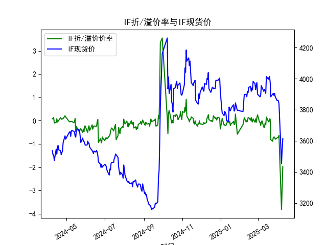
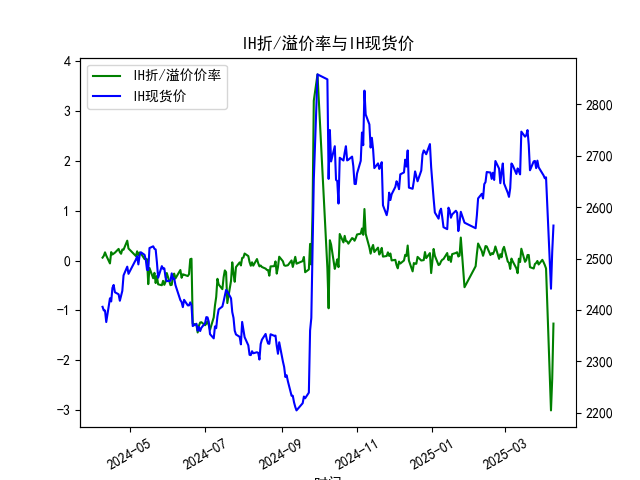
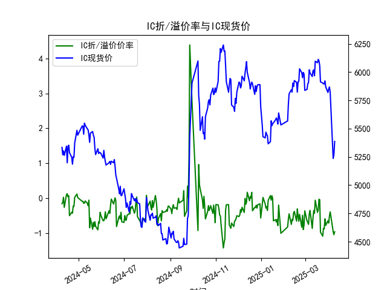
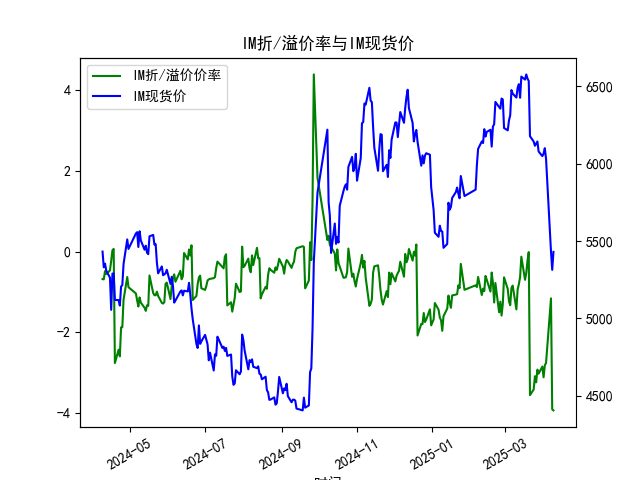

|            |   IF折/溢价率 |   IF现货价 |   IH折/溢价率 |   IH现货价 |   IC折/溢价率 |   IC现货价 |   IH折/溢价率 |   IH现货价 |
|:-----------|--------------:|-----------:|--------------:|-----------:|--------------:|-----------:|--------------:|-----------:|
| 2025-03-12 |    -0.102655  |     3923.2 |    0.03692    |     2670   |    -0.355873  |     6019   |    -0.809626  |     6513.8 |
| 2025-03-13 |    -0.173314  |     3904.8 |   -0.0306723  |     2663.8 |    -0.436556  |     5967.8 |    -0.631697  |     6426   |
| 2025-03-14 |     0.155827  |     4012.8 |    0.236942   |     2747   |    -0.0619822 |     6096.2 |    -0.127385  |     6562.8 |
| 2025-03-17 |    -0.0197058 |     3996   |   -0.0263959  |     2737.2 |    -0.409586  |     6083   |    -0.700585  |     6543.4 |
| 2025-03-18 |    -0.0529702 |     4005.6 |    0.00929648 |     2740   |    -0.340792  |     6112.4 |    -0.528232  |     6577   |
| 2025-03-19 |     0.0756078 |     4013.2 |    0.110569   |     2750   |    -0.0333839 |     6099.4 |    -0.223571  |     6550   |
| 2025-03-20 |     0.0656152 |     3977.6 |    0.110875   |     2721.2 |    -0.0476262 |     6056.6 |    -0.0131965 |     6534.2 |
| 2025-03-21 |    -0.814766  |     3882.8 |   -0.132984   |     2671.8 |    -0.976739  |     5913.6 |    -3.56267   |     6177.4 |
| 2025-03-24 |    -0.880557  |     3900.2 |   -0.160816   |     2689   |    -1.09362   |     5903.8 |    -3.42028   |     6142.8 |
| 2025-03-25 |    -0.709385  |     3904.4 |   -0.070493   |     2690   |    -0.870211  |     5895.2 |    -3.09256   |     6115.6 |
| 2025-03-26 |    -0.70309   |     3891.8 |   -0.0490081  |     2676   |    -0.885914  |     5895.8 |    -3.24405   |     6129.4 |
| 2025-03-27 |    -0.707243  |     3904.6 |   -0.0090232  |     2690.6 |    -0.594227  |     5922.2 |    -2.92895   |     6143.4 |
| 2025-03-28 |    -0.796038  |     3884   |   -0.0798548  |     2677.6 |    -0.78484   |     5869.6 |    -3.02986   |     6078.4 |
| 2025-03-31 |    -0.738445  |     3858.6 |    0.0137341  |     2666   |    -0.651649  |     5819.6 |    -2.85304   |     6049   |
| 2025-04-01 |    -0.722386  |     3859.6 |   -0.0342245  |     2661.8 |    -0.716974  |     5850.6 |    -3.11981   |     6064.2 |
| 2025-04-02 |    -0.689576  |     3857.6 |   -0.0910585  |     2656.2 |    -0.5168    |     5868.6 |    -2.82374   |     6100   |
| 2025-04-03 |    -0.634556  |     3837   |   -0.159722   |     2658   |    -0.395252  |     5822.4 |    -2.76398   |     6031.8 |
| 2025-04-07 |    -3.81231   |     3452.6 |   -3.01018    |     2441.2 |    -0.961471  |     5236.2 |    -1.16153   |     5432.6 |
| 2025-04-08 |    -2.92977   |     3543.8 |   -2.37547    |     2513.2 |    -1.04965   |     5271   |    -3.91353   |     5313.6 |
| 2025-04-09 |    -1.97446   |     3614   |   -1.26686    |     2564.2 |    -0.96643   |     5387.2 |    -3.9405    |     5429.6 |

# 股指期货折/溢价率与现货价分析

## 一、折/溢价率与现货价的相关性及影响逻辑

### 1. 折溢价率的定义与形成机制
折溢价率反映期货价格与现货指数的偏离程度：
- **溢价（正数）**：期货价格高于现货，隐含市场对未来的乐观预期或资金成本补偿需求
- **折价（负数）**：期货价格低于现货，反映市场悲观预期或存在套利机会

### 2. 核心影响逻辑
（1）**市场预期驱动**  
当投资者预期未来指数上涨时，期货合约往往呈现溢价；反之折价。例如IM合约在2025年4月出现-3.9%的深度折价，可能反映对中小盘股的强烈看空预期。

（2）**套利机制调节**  
当折溢价超过无套利区间时，会引发期现套利：
- 溢价过高时：卖出期货+买入现货（正向套利）
- 折价过深时：买入期货+卖出现货（反向套利）
如IF在2025年4月7日出现-3.8%的折价，可能吸引反向套利资金介入。

（3）**资金成本与分红因素**  
期货定价需考虑持有现货的资金成本（利率）和成分股分红。例如IH合约在分红季通常呈现系统性折价，因期货价格需扣除预期分红。

（4）**流动性溢价**  
流动性较差的合约（如IM）往往需要更大的折溢价补偿交易风险，数据中IM的折价波动幅度显著大于其他合约。

## 二、近期投资机会与策略分析

### 1. 异常折价机会
（1）**IM合约深度折价**  
2025年4月8-9日IM折价率突破-3.9%，结合现货价从5313反弹至5429，可考虑：
- **反向套利**：买入IM期货同时融券卖空现货组合
- **单边策略**：若判断市场超跌，可建立期货多头，博弈基差收敛

（2）**IH/IF跨品种套利**  
IH折价率（-1.27%）显著小于IF（-1.97%），可构建：
- 做多IF期货 + 做空IH期货，利用折价差异收敛

### 2. 趋势性机会
（1）**IC合约波动特征**  
IC折价率在-0.39%到-0.96%间震荡，现货价处于5200-5800区间波动，适合：
- **波动率策略**：卖出宽跨式期权组合，赚取时间价值
- **网格交易**：在现货价5200-5800区间设置分批建仓

（2）**季节性机会**  
临近2025年4月季月合约交割（通常第三个周五），关注：
- **交割周套利**：捕捉期现价差收敛的确定性收益
- **展期收益**：比较不同合约折价差异，优化移仓时点

### 3. 风险提示
- **流动性风险**：IM合约成交量较低，反向套利需控制冲击成本
- **政策风险**：关注监管层对程序化交易的潜在限制措施
- **极端波动**：2025年4月7日多个合约出现单日3%以上波动，需强化风控

（注：具体策略需结合实时市场数据、资金成本和交易费率进行精细化测算）

