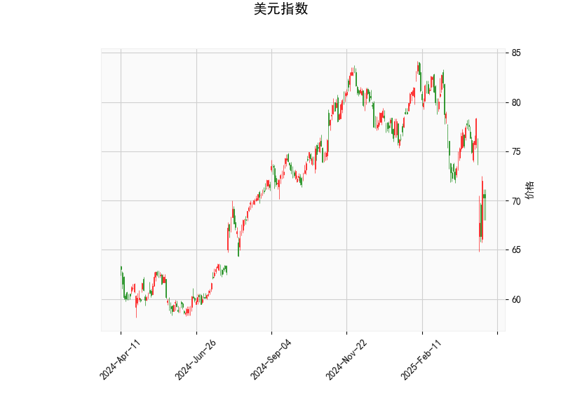

# 美元指数技术分析解读

## 一、美元指数技术指标分析

### 1. 价格与布林带
- **当前价70.3**已跌破布林带下轨（69.57），且远低于中轨（77.68），显示美元指数处于超跌状态。短期可能面临技术性反弹，但若持续低于下轨则可能加速下行。

### 2. RSI指标
- **RSI=40.87**接近中性区间下沿，未达超卖阈值（30），表明当前下跌动能虽未完全释放，但市场情绪偏向悲观。

### 3. MACD指标
- **MACD线（-1.93）低于信号线（-1.43）**，柱状图持续负值，显示短期下跌趋势延续。但两者差值缩小（-0.5），暗示下跌动能可能减弱。

### 4. K线形态
- **CDLMATCHINGLOW**（低位匹配线）：典型底部反转信号，需配合量能确认。
- **CDLSPINNINGTOP**（纺锤线）：反映多空博弈激烈，短期方向不明，可能伴随趋势反转或震荡延续。

**综合判断**：美元指数处于超跌区间，技术面存在反弹需求，但需关注布林带下轨支撑有效性及MACD能否形成金叉确认反转。

---

## 二、A股与港股投资机会及策略

### 1. 美元走弱联动效应
- **汇率传导**：美元弱势通常推动人民币升值，吸引外资流入中国股市（A股/港股），利好外资偏好板块（消费、科技、新能源）。
- **港股美元计价特性**：美元贬值直接提升以港元计价资产的吸引力，恒生指数成分股（如互联网龙头）或受益。

### 2. A股机会
- **外资流入受益板块**：
  - **消费**：白酒、家电（北向资金传统重仓）
  - **成长赛道**：半导体、光伏、电动车（外资风险偏好提升）
- **技术面策略**：
  - **超跌反弹**：关注RSI低于30且MACD底背离的个股（如部分医药、消费电子）。
  - **突破交易**：若上证指数站稳3300点，可布局突破年线的强势股。

### 3. 港股机会
- **AH溢价套利**：
  - 筛选AH溢价率>30%的H股（如中信建投、中芯国际），做多H股同时做空A股对冲。
  - 需关注港股通资金流向及汇率波动风险。
- **板块轮动**：
  - **互联网**：估值修复逻辑（政策风险边际缓和+美元流动性改善）。
  - **金融地产**：若香港跟随美联储降息，高股息标的（如汇丰、中银香港）防御性凸显。

### 4. 风险对冲策略
- **跨市场对冲**：做多恒生科技指数ETF（HSTECH）同时做空美元指数期货（DXY）。
- **期权保护**：买入A50指数看跌期权对冲短期回调风险，成本约合约价值的2-3%。

---

## 三、关键观察信号
1. **美元指数**：若MACD金叉且站上布林带中轨（77.68），需警惕外资回流风险。
2. **北向资金**：单日净流入超80亿人民币或为A股加速上涨信号。
3. **恒生指数**：突破21,000点关口可能触发空头回补行情。

**注**：以上策略需结合美联储政策、国内经济数据及地缘政治动态综合研判。