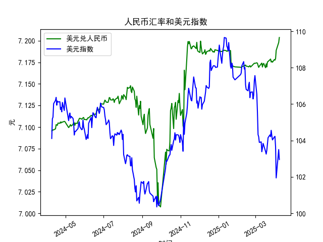

|            |   人民币汇率 |   美元指数 |
|:-----------|-------------:|-----------:|
| 2025-03-11 |       7.1741 |    103.386 |
| 2025-03-12 |       7.1696 |    103.587 |
| 2025-03-13 |       7.1728 |    103.836 |
| 2025-03-14 |       7.1738 |    103.736 |
| 2025-03-17 |       7.1688 |    103.399 |
| 2025-03-18 |       7.1733 |    103.254 |
| 2025-03-19 |       7.1697 |    103.463 |
| 2025-03-20 |       7.1754 |    103.817 |
| 2025-03-21 |       7.176  |    104.154 |
| 2025-03-24 |       7.178  |    104.307 |
| 2025-03-25 |       7.1788 |    104.21  |
| 2025-03-26 |       7.1754 |    104.559 |
| 2025-03-27 |       7.1763 |    104.26  |
| 2025-03-28 |       7.1752 |    104.034 |
| 2025-03-31 |       7.1782 |    104.192 |
| 2025-04-01 |       7.1775 |    104.226 |
| 2025-04-02 |       7.1793 |    103.661 |
| 2025-04-03 |       7.1889 |    101.945 |
| 2025-04-07 |       7.198  |    103.501 |
| 2025-04-08 |       7.2038 |    102.956 |

### 1. 人民币汇率与美元指数的相关性及影响逻辑

#### （1）基础相关性
人民币汇率（如美元兑人民币汇率）与美元指数（DXY）通常呈现**负相关**关系。美元指数衡量美元对一篮子主要货币（如欧元、日元、英镑等）的强弱，当美元指数上涨时，美元走强，其他货币相对贬值。由于人民币汇率以“美元兑人民币”形式报价，美元走强时，人民币汇率数值通常上升（即人民币贬值），反之则下降（人民币升值）。

#### （2）影响逻辑
- **直接传导机制**：美元指数上升通常反映美联储紧缩政策（如加息）或全球避险情绪升温，导致资本回流美元资产。这会加大人民币贬值压力，尤其在跨境资本流动较自由时。
- **政策干预因素**：中国央行可能通过逆周期因子、外汇储备调节或口头干预平抑汇率波动，导致人民币汇率与美元指数短期背离。
- **经济基本面差异**：若中国经济增速、贸易顺差或利差（如中美国债收益率差）明显改善，人民币可能脱离美元指数走势独立升值。
- **市场预期与风险情绪**：若美元指数因美国经济衰退预期下跌，而中国政策刺激预期增强，人民币可能同步走强。

#### （3）数据验证
从提供的数据来看：
- **美元指数波动区间**：近一年从约100升至109后回落至102附近，整体呈现震荡。
- **人民币汇率走势**：从7.09逐步升至7.20以上，后回落至7.17-7.20区间，与美元指数阶段性同向（如美元指数升至109时人民币汇率破7.20），但政策干预后出现短期背离。

---

### 2. 近期投资或套利机会与策略

#### （1）趋势性机会
- **美元短期回调与人民币修复性升值**：
  - **逻辑**：若美联储释放降息信号或美国经济数据走弱，美元指数可能回调。叠加中国稳增长政策（如降息、地产放松）提振信心，人民币或阶段性升值。
  - **策略**：做多离岸人民币（CNH）或买入人民币看涨期权，关注美元指数关键支撑位（如103.5）。

#### （2）套利机会
- **在岸-离岸汇率价差套利**：
  - **逻辑**：在岸（CNY）与离岸（CNH）人民币价差扩大时，可通过跨境贸易结算或金融工具锁定价差。
  - **策略**：若CNH较CNY大幅贴水（贬值更多），通过境内购汇、境外结汇套利（需合规通道）。

- **利差交易（Carry Trade）**：
  - **逻辑**：中美利差倒挂（如中国国债收益率低于美国）可能收窄，吸引资本回流人民币资产。
  - **策略**：借入低息美元（如美元LIBOR），兑换为人民币后投资高息资产（如中国国债）。

#### （3）风险对冲策略
- **汇率波动对冲**：
  - **逻辑**：若企业有美元负债或进口需求，可对冲人民币贬值风险。
  - **工具**：买入美元兑人民币远期合约或人民币贬值期权。

#### （4）技术面信号
- **关键位置突破**：
  - **人民币汇率关键阻力位**：7.20（前期高点），若有效突破可能打开升值空间至7.15。
  - **美元指数支撑位**：103.5（2023年10月低点），跌破后或加速下行。

---

### 风险提示
1. **政策风险**：中国央行逆周期调节可能逆转短期汇率趋势。
2. **地缘政治**：中美关系、台海局势等事件可能引发避险情绪。
3. **流动性风险**：离岸人民币市场深度不足，价差套利需注意执行成本。