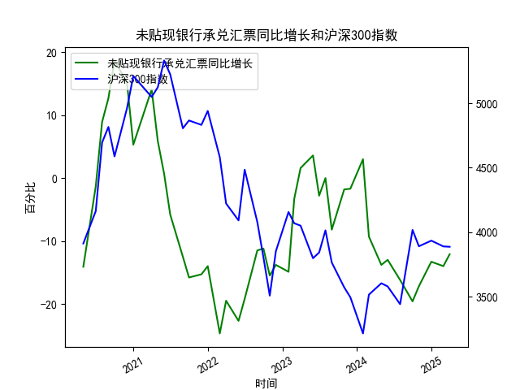

|            |   未贴现银行承兑汇票同比增长 |   沪深300指数 |
|:-----------|-----------------------------:|--------------:|
| 2022-11-30 |                        -13.8 |       3853.04 |
| 2023-01-31 |                        -14.9 |       4156.86 |
| 2023-02-28 |                         -3.3 |       4069.46 |
| 2023-03-31 |                          1.6 |       4050.93 |
| 2023-05-31 |                          3.6 |       3798.54 |
| 2023-06-30 |                         -2.8 |       3842.45 |
| 2023-07-31 |                          0   |       4014.63 |
| 2023-08-31 |                         -8.2 |       3765.27 |
| 2023-10-31 |                         -1.8 |       3572.51 |
| 2023-11-30 |                         -1.7 |       3496.2  |
| 2024-01-31 |                          3   |       3215.35 |
| 2024-02-29 |                         -9.3 |       3516.08 |
| 2024-04-30 |                        -13.8 |       3604.39 |
| 2024-05-31 |                        -13   |       3579.92 |
| 2024-07-31 |                        -16.2 |       3442.08 |
| 2024-09-30 |                        -19.6 |       4017.85 |
| 2024-10-31 |                        -17.2 |       3891.04 |
| 2024-12-31 |                        -13.3 |       3934.91 |
| 2025-02-28 |                        -14   |       3890.05 |
| 2025-03-31 |                        -12.1 |       3887.31 |

### 1. 未贴现银行承兑汇票月同比增长与沪深300指数的相关性及影响逻辑

#### 相关性分析
从数据趋势看，未贴现银行承兑汇票的月同比增长率与沪深300指数存在**阶段性正相关性**，但并非严格同步。例如：
- **初期正相关**：未贴现汇票增速从-14.1%逐步攀升至18.7%（前6个月），对应沪深300从3912点上涨至5211点，反映企业融资需求扩张和市场流动性改善推动股市上行。
- **中期分化**：未贴现汇票增速大幅下滑至-24.7%（第6-12个月），同期沪深300指数从5211点回落至3508点，显示流动性收紧对股市的压制作用。
- **后期弱相关**：未贴现汇票增速在低位震荡（-16.2%至-12.1%），而沪深300指数在3442-4017点区间波动，表明市场可能对流动性变化的敏感度下降。

#### 影响逻辑
1. **流动性传导机制**：
   - 未贴现汇票增速上升 → 企业短期融资需求旺盛 → 银行信用扩张 → 市场流动性充裕 → 资金流入股市 → 沪深300上涨。
   - 反之，未贴现汇票收缩 → 信用环境收紧 → 流动性压力增大 → 股市承压。

2. **经济预期信号**：
   - 未贴现汇票增长反映实体经济活动活跃（如企业贸易需求增加），可能提升投资者对盈利改善的预期 → 推动沪深300估值修复。
   - 若未贴现汇票持续萎缩，则可能预示企业信心不足或银行风险偏好下降 → 市场避险情绪升温。

3. **政策调节作用**：
   - 央行通过调节票据贴现利率或信贷政策影响未贴现汇票规模，间接引导市场资金成本 → 改变股市风险溢价水平。

---

### 2. 近期投资或套利机会与策略

#### 潜在机会判断
- **短期流动性反弹信号**：若未贴现银行承兑汇票增速连续2个月回升（如从-14%反弹至-5%附近），可能预示流动性边际改善，可关注沪深300超跌板块（如金融、消费）。
- **背离修复机会**：若未贴现汇票增速持续低位但沪深300因政策利好提前反弹（如近期稳增长政策加码），可能形成“流动性悲观预期修正”驱动上涨。
- **跨市场套利窗口**：若未贴现汇票增速与同业存单利率出现反向波动（如票据增速回升但存单利率下行），可做多沪深300股指期货同时做空国债期货，博弈流动性宽松预期。

#### 策略建议
1. **波段交易策略**：
   - **触发条件**：未贴现汇票增速连续两月回升 + 沪深300指数PE分位数低于30%。
   - **操作**：分批买入沪深300ETF（如510300），目标涨幅5-8%，止损线设为前低。

2. **对冲套利策略**：
   - **逻辑**：利用未贴现汇票增速与市场情绪的时间差。
   - **操作**：当未贴现汇票增速触底但市场情绪仍悲观时，买入沪深300看涨期权（行权价高于现价3%），同时卖出看跌期权降低权利金成本。

3. **行业轮动策略**：
   - **优先配置**：与票据融资关联度高的周期行业（如机械、建材），若未贴现汇票增速回升，此类行业或率先受益于补库需求。
   - **规避方向**：若未贴现汇票增速再度跌破-15%，减仓高杠杆板块（如地产、航空）。

#### 风险提示
- **政策不确定性**：票据监管政策变化（如窗口指导）可能扭曲相关性逻辑。
- **外部冲击**：美联储加息周期或地缘冲突可能压制风险偏好，削弱流动性传导效果。
- **数据滞后性**：未贴现汇票数据发布滞后约1个月，需结合高频指标（如SHIBOR、DR007）交叉验证。