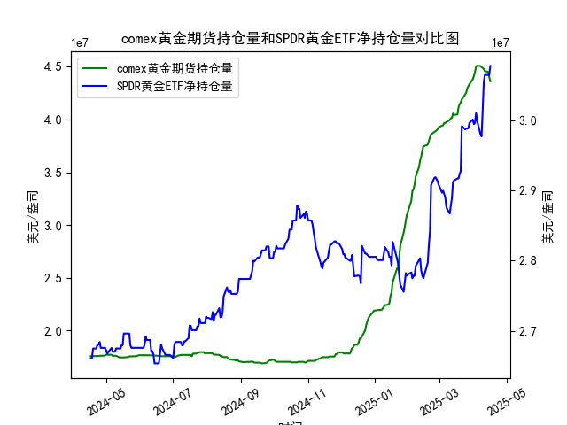

|            |   comex黄金期货持仓量 |   SPDR黄金ETF净持仓量 |
|:-----------|----------------------:|----------------------:|
| 2025-03-20 |           4.15947e+07 |           2.92711e+07 |
| 2025-03-21 |           4.18912e+07 |           2.99167e+07 |
| 2025-03-24 |           4.23644e+07 |           2.98706e+07 |
| 2025-03-25 |           4.25535e+07 |           2.98798e+07 |
| 2025-03-26 |           4.29362e+07 |           2.98798e+07 |
| 2025-03-27 |           4.31683e+07 |           2.98891e+07 |
| 2025-03-28 |           4.33476e+07 |           2.99628e+07 |
| 2025-03-31 |           4.38069e+07 |           3.0009e+07  |
| 2025-04-01 |           4.41117e+07 |           2.99444e+07 |
| 2025-04-02 |           4.4464e+07  |           2.99628e+07 |
| 2025-04-03 |           4.50467e+07 |           3.01012e+07 |
| 2025-04-04 |           4.50717e+07 |           2.99905e+07 |
| 2025-04-07 |           4.50642e+07 |           2.97969e+07 |
| 2025-04-08 |           4.49537e+07 |           2.97692e+07 |
| 2025-04-09 |           4.4872e+07  |           3.01284e+07 |
| 2025-04-10 |           4.47928e+07 |           3.05341e+07 |
| 2025-04-11 |           4.4576e+07  |           3.06448e+07 |
| 2025-04-14 |           4.45116e+07 |           3.06448e+07 |
| 2025-04-15 |           4.40124e+07 |           3.06448e+07 |
| 2025-04-16 |           4.36175e+07 |           3.07739e+07 |

### 1. MSCI新兴市场指数和铜价相关性及影响逻辑

#### 相关性
MSCI新兴市场指数与铜价通常呈现**正相关性**，两者均与全球经济周期（尤其是新兴市场需求）紧密相关。具体表现如下：
- **经济扩张期**：新兴市场国家（如中国、印度）的基建投资和制造业活动增加，推高铜需求，铜价上涨；同时企业盈利改善带动股市上涨，MSCI新兴市场指数同步走强。
- **经济收缩期**：工业活动放缓导致铜需求下降，铜价承压；股市因企业盈利下滑而下跌，MSCI指数同步走弱。

#### 影响逻辑
1. **需求驱动**：
   - 铜是工业金属的“风向标”，广泛应用于电力、建筑和制造业。新兴市场占全球铜消费的60%以上（中国约占50%），其经济增长直接决定铜价趋势。
   - MSCI新兴市场指数成分股中，原材料和工业板块占比较高，与铜价形成共振。

2. **风险偏好传导**：
   - 新兴市场经济增长预期增强时，投资者风险偏好上升，资金同时流入股市和大宗商品（如铜），形成正向反馈。
   - 美元走弱时，以美元计价的铜价上涨，同时新兴市场资产吸引力提升，进一步强化相关性。

3. **政策联动**：
   - 新兴市场国家宽松货币政策刺激基建投资，既提振股市，又增加铜需求。例如中国的“稳增长”政策常同步推动铜价和股市上涨。

---

### 2. 近期投资或套利机会及策略分析

#### 数据观察（基于持仓数据）
- **COMEX黄金期货持仓**：近期持仓量从低位（约1690万盎司）攀升至历史高位（约4380万盎司），显示机构对黄金的配置需求激增。
- **SPDR黄金ETF持仓**：净持仓量从2660万盎司波动上升至3077万盎司，反映散户和长期资金持续流入。

#### 潜在机会与策略
1. **黄金多头策略**：
   - **逻辑**：COMEX和ETF持仓同步增长，叠加美联储降息预期升温、地缘政治风险（如中东局势），黄金避险属性凸显。
   - **操作**：买入黄金期货或ETF，目标看向前高（2400美元/盎司），止损设于2100美元。

2. **期现套利**：
   - **逻辑**：COMEX期货持仓激增但现货市场（ETF）流入相对滞后，若期货溢价（Contango）扩大，可做空期货、买入现货。
   - **操作**：监控COMEX远期合约升水幅度，当升水超过持仓成本（约0.5%/月）时入场套利。

3. **黄金-铜对冲策略**：
   - **逻辑**：新兴市场复苏不及预期可能导致铜价回调，但黄金受益于避险需求。做多黄金、做空铜（通过期货或ETF）。
   - **操作**：比值（黄金价格/铜价）低于历史均值时建仓，目标修复至均值上方。

4. **波动率交易**：
   - **逻辑**：黄金持仓创历史新高，市场分歧加大，隐含波动率（VIX黄金指数）可能上行。
   - **操作**：买入跨式期权组合（同时买入看涨和看跌期权），押注价格突破。

#### 风险提示
- **政策风险**：美联储推迟降息或美元走强可能压制金价。
- **持仓拥挤**：COMEX持仓达历史高位，需警惕多头平仓引发的回调。