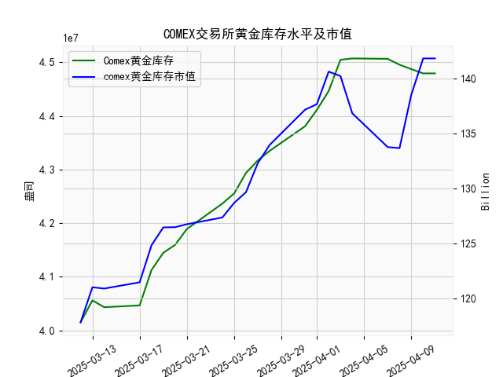

|            |   comex黄金库存量 |   comex黄金库存市值(billion) |   伦敦金现货价 |   上海金交所黄金现货价 |   美元兑人民币汇率 |
|:-----------|------------------:|-----------------------------:|---------------:|-----------------------:|-------------------:|
| 2025-03-17 |       4.0466e+07  |                       3001.5 |        2996.5  |                 695.4  |             7.1688 |
| 2025-03-18 |       4.11244e+07 |                       3035.2 |        3025.8  |                 700.8  |             7.1733 |
| 2025-03-19 |       4.14469e+07 |                       3050.9 |        3027.55 |                 707.7  |             7.1697 |
| 2025-03-20 |       4.15947e+07 |                       3040.6 |        3038.15 |                 709.09 |             7.1754 |
| 2025-03-21 |       4.18912e+07 |                       3025.5 |        3013.7  |                 706.55 |             7.176  |
| 2025-03-24 |       4.23644e+07 |                       3006   |        3007.75 |                 705.92 |             7.178  |
| 2025-03-25 |       4.25535e+07 |                       3024   |        3025.2  |                 704.56 |             7.1788 |
| 2025-03-26 |       4.29362e+07 |                       3019.5 |        3013.25 |                 707.79 |             7.1754 |
| 2025-03-27 |       4.31683e+07 |                       3064.5 |        3056.55 |                 709.29 |             7.1763 |
| 2025-03-28 |       4.33476e+07 |                       3090   |        3071.6  |                 721.03 |             7.1752 |
| 2025-03-31 |       4.38069e+07 |                       3130.9 |        3115.1  |                 730.8  |             7.1782 |
| 2025-04-01 |       4.41117e+07 |                       3120.6 |        3133.7  |                 735.84 |             7.1775 |
| 2025-04-02 |       4.4464e+07  |                       3162.3 |        3119.75 |                 732.5  |             7.1793 |
| 2025-04-03 |       4.50467e+07 |                       3112.6 |        3118.1  |                 738.94 |             7.1889 |
| 2025-04-04 |       4.50717e+07 |                       3035.6 |        3054.5  |                 738.94 |             7.1889 |
| 2025-04-07 |       4.50642e+07 |                       2968   |        3014.75 |                 713.98 |             7.198  |
| 2025-04-08 |       4.49537e+07 |                       2973.3 |        3015.4  |                 717.5  |             7.2038 |
| 2025-04-09 |       4.4872e+07  |                       3087.2 |        3075.5  |                 728.88 |             7.2066 |
| 2025-04-10 |       4.47928e+07 |                       3166   |        3143.15 |                 741.26 |             7.2092 |
| 2025-04-11 |       4.47928e+07 |                       3166   |        3143.15 |                 741.26 |             7.2087 |

### 近期COMEX黄金库存与市场套利机会分析

#### **1. 库存与市值背离（关键矛盾点）**
- **库存变化**：最近一周（4月4日-4月11日）COMEX黄金库存从**4507万**降至**4479万**（降幅约0.6%），但同期库存市值从**136.82亿**美元升至**141.81亿**美元（增幅3.6%）。  
- **隐含逻辑**：库存下降伴随市值上升，表明**金价上涨是市值增长主因**，而非库存增量。这可能反映市场对黄金的避险需求升温，或存在期货溢价（Contango）推动库存被动消耗。

#### **2. 跨市场价差套利机会**
- **伦敦 vs 上海金价**（以4月11日为例）：  
  - 伦敦金价：**3143.15美元/盎司**  
  - 上海金价：**741.26元/克**（需换算为美元计价）  
  - 汇率：1美元=**7.2087**人民币  
  - **等价换算**：伦敦金价 → **3143.15 × 7.2087 / 31.1035 ≈ 728.15元/克**  
  - **价差**：上海溢价**13.11元/克**（约1.8%）。  
- **策略建议**：若交易成本（物流、手续费等）低于价差，可考虑**买入伦敦金、卖出上海金**的跨市套利。需注意人民币汇率波动风险（近期美元兑人民币持续升值可能压缩套利空间）。

#### **3. 库存下降的潜在驱动**
- **近期库存变动**：4月4日-11日库存减少约28万盎司（约8.7吨），可能源于：  
  - **交割需求**：期货合约到期前空头需实物交割。  
  - **套利转移**：若其他市场（如上海）溢价更高，可能触发库存转移。  
- **策略建议**：若库存持续下降且期货保持升水，可关注**买现货、卖期货**的期现套利机会，但需评估持仓成本。

#### **4. 汇率与价格联动**
- **美元兑人民币汇率**：最近一周从**7.1889**升至**7.2087**（人民币贬值0.28%），而上海金价上涨**2.3%**。  
- **隐含影响**：人民币贬值或推升国内金价，但需警惕汇率快速波动对跨市套利的双向冲击。

#### **5. 风险提示**
- **流动性风险**：套利需双边市场同步成交，极端行情下可能滑点扩大。  
- **政策风险**：跨境黄金流动可能受监管限制（如中国进口配额）。  
- **时间窗口**：近期价差波动较大（如4月7日上海金价单日下跌2.3%），需高频跟踪。

### **综合建议**
- **短期策略**：优先关注**伦敦-上海价差套利**（当前溢价1.8%），若价差扩大至2%以上可逐步建仓。  
- **中期观察**：若COMEX库存持续下降且期货保持升水，可布局期现套利组合。  
- **风控重点**：设置价差阈值止损（如1%），并动态对冲汇率风险（如NDF或期货锁汇）。