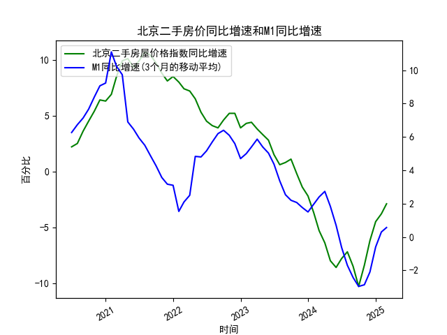

|            |   北京二手房屋价格指数同比增速 |   M1同比增速 |   M1同比增速(3个月的移动平均) |
|:-----------|-------------------------------:|-------------:|------------------------------:|
| 2023-07-31 |                            0.6 |          2.3 |                      3.36667  |
| 2023-08-31 |                            0.8 |          2.2 |                      2.53333  |
| 2023-09-30 |                            1.1 |          2.1 |                      2.2      |
| 2023-10-31 |                           -0.2 |          1.9 |                      2.06667  |
| 2023-11-30 |                           -1.4 |          1.3 |                      1.76667  |
| 2023-12-31 |                           -2.2 |          1.3 |                      1.5      |
| 2024-01-31 |                           -3.7 |          3.3 |                      1.96667  |
| 2024-02-29 |                           -5.3 |          2.6 |                      2.4      |
| 2024-03-31 |                           -6.4 |          2.3 |                      2.73333  |
| 2024-04-30 |                           -8   |          0.6 |                      1.83333  |
| 2024-05-31 |                           -8.6 |         -0.8 |                      0.7      |
| 2024-06-30 |                           -7.8 |         -1.7 |                     -0.633333 |
| 2024-07-31 |                           -7.2 |         -2.6 |                     -1.7      |
| 2024-08-31 |                           -8.5 |         -3   |                     -2.43333  |
| 2024-09-30 |                          -10.3 |         -3.3 |                     -2.96667  |
| 2024-10-31 |                           -8.4 |         -2.3 |                     -2.86667  |
| 2024-11-30 |                           -6.2 |         -0.7 |                     -2.1      |
| 2024-12-31 |                           -4.5 |          1.2 |                     -0.6      |
| 2025-01-31 |                           -3.8 |          0.4 |                      0.3      |
| 2025-02-28 |                           -2.9 |          0.1 |                      0.566667 |

### 1. 北京二手房价指数同比增速与M1同比增速的相关性及影响逻辑

#### **相关性分析**
从数据走势来看，北京二手房价指数同比增速与M1同比增速呈现**阶段性正相关**，但存在**滞后效应**。具体表现为：
- **同步波动**：在前期（数据前1/3部分），M1增速持续上升（6.3%→11.1%），房价增速同步攀升（2.2%→10.1%），反映流动性宽松推动房价上涨。
- **滞后传导**：当M1增速见顶回落时（如从11.1%降至负值），房价增速随后也进入下行周期，但反应滞后约6-12个月。例如，M1增速在2021年中开始负增长时，房价增速在2022年才加速下跌至-10.3%。
- **底部共振**：近期M1增速从-2.4%回升至0.6%，同时房价跌幅从-10.3%收窄至-2.9%，显示两者可能进入同步修复阶段。

#### **影响逻辑**
1. **流动性驱动**：M1增速代表短期货币供应，直接影响市场购买力。M1扩张时，信贷宽松刺激购房需求，推高房价；收缩时，流动性收紧抑制需求，导致房价下行。
2. **政策传导**：中国货币政策常与房地产调控联动。M1增速上升可能伴随降准降息（如经济刺激），而增速下降可能反映调控收紧（如限贷、限购），进一步放大房价波动。
3. **预期反馈**：房价增速与M1增速的联动会强化市场预期。例如，M1触底回升可能被解读为政策转向宽松信号，吸引投资者入场，形成正反馈。

---

### 2. 近期投资或套利机会与策略

#### **机会判断**
- **触底反弹机会**：当前M1增速已从低点（-2.4%）回升至正增长（0.6%），房价跌幅同步收窄，可能预示**房地产市场进入复苏初期**。
- **政策博弈窗口**：若后续货币政策延续宽松（如进一步降息），房价修复弹性可能加大，尤其核心区域二手房可能率先企稳。

#### **策略建议**
1. **核心地段二手房逢低布局**：
   - **标的**：选择北京五环内交通便利、学区资源优质的二手房，抗跌性强且反弹速度快。
   - **时机**：结合M1增速连续3个月回升时逐步建仓，避免短期波动风险。

2. **REITs或地产股波段操作**：
   - **工具**：关注以北京二手房市场为主营的房地产信托（REITs）或龙头中介公司股票（如贝壳）。
   - **策略**：在M1增速拐点出现时买入，利用市场情绪回暖博取估值修复收益。

3. **套利策略（政策差异）**：
   - **跨区域套利**：若北京调控政策放松滞后于其他城市，可先布局政策已松绑的二线城市（如成都、杭州），待北京政策明朗后切换标的。
   - **租售比修复**：当前租金回报率处于历史低位（约1.5%），若利率下行推动租售比回归合理区间（2%-3%），可通过长租合约锁定低价房源，等待资产重估。

#### **风险提示**
- **政策不确定性**：需密切关注房地产税试点、限购政策调整等突发政策冲击。
- **流动性陷阱**：若M1回升但信贷未有效流入实体经济（如企业持币观望），房价反弹可能不及预期。
- **时间窗口短暂**：市场修复期通常较短（6-12个月），需设定止盈止损纪律。