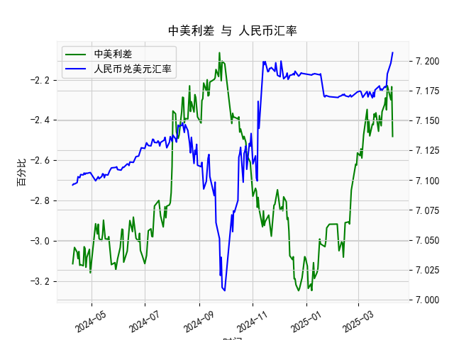

|            |   美国债两年收益率 |   中国债两年收益率 |   人民币兑美元汇率 |   中美利差 |
|:-----------|-------------------:|-------------------:|-------------------:|-----------:|
| 2025-03-12 |               4.01 |             1.5485 |             7.1696 |    -2.4615 |
| 2025-03-13 |               3.94 |             1.5379 |             7.1728 |    -2.4021 |
| 2025-03-14 |               4.02 |             1.5408 |             7.1738 |    -2.4792 |
| 2025-03-17 |               4.06 |             1.6393 |             7.1688 |    -2.4207 |
| 2025-03-18 |               4.04 |             1.6168 |             7.1733 |    -2.4232 |
| 2025-03-19 |               3.99 |             1.6203 |             7.1697 |    -2.3697 |
| 2025-03-20 |               3.95 |             1.5653 |             7.1754 |    -2.3847 |
| 2025-03-21 |               3.94 |             1.5756 |             7.176  |    -2.3644 |
| 2025-03-24 |               4.04 |             1.5837 |             7.178  |    -2.4563 |
| 2025-03-25 |               3.96 |             1.5813 |             7.1788 |    -2.3787 |
| 2025-03-26 |               3.98 |             1.5616 |             7.1754 |    -2.4184 |
| 2025-03-27 |               3.97 |             1.5411 |             7.1763 |    -2.4289 |
| 2025-03-28 |               3.89 |             1.5314 |             7.1752 |    -2.3586 |
| 2025-03-31 |               3.89 |             1.5674 |             7.1782 |    -2.3226 |
| 2025-04-01 |               3.87 |             1.5798 |             7.1775 |    -2.2902 |
| 2025-04-02 |               3.91 |             1.5602 |             7.1793 |    -2.3498 |
| 2025-04-03 |               3.71 |             1.4804 |             7.1889 |    -2.2296 |
| 2025-04-07 |               3.73 |             1.4304 |             7.198  |    -2.2996 |
| 2025-04-08 |               3.71 |             1.4753 |             7.2038 |    -2.2347 |
| 2025-04-09 |               3.91 |             1.4282 |             7.2066 |    -2.4818 |

# 中美利差与人民币汇率的相关性及影响逻辑

## 1. 中美利差与人民币汇率的相关性及影响逻辑

### （1）理论相关性
中美利差（中国国债收益率 - 美国国债收益率）与人民币汇率（直接标价法，数值上升代表人民币贬值）存在**负向关联性**：
- **利差收窄**（即中国收益率相对上升/美国收益率下降）：  
  资本可能回流中国，推动人民币升值（汇率数值下降）。  
- **利差扩大**（即美国收益率相对更高）：  
  资本外流压力增加，人民币面临贬值压力（汇率数值上升）。

### （2）数据验证与逻辑修正
从近1年数据看：
- **利差持续为负**（美国收益率高于中国），但人民币汇率整体呈现**双向波动**，并未单边贬值。  
- **背离现象**：利差绝对值扩大时（如从-2.8扩大至-3.2），人民币汇率并未同步大幅贬值，甚至阶段性升值。  

**核心原因**：  
1. **政策干预**：中国央行通过逆周期调节因子、外汇准备金率等工具平滑汇率波动。  
2. **市场预期**：美联储加息周期尾声的预期可能削弱美元吸引力。  
3. **经济基本面**：中国贸易顺差和外资流入（如债券市场）对汇率形成支撑。

---

## 2. 近期投资或套利机会与策略

### （1）潜在机会判断
- **利差边际变化**：近期利差从-3.2收窄至-2.48（绝对值减小），显示中美收益率差距缩小。  
- **汇率表现**：人民币汇率从7.20附近小幅回升至7.17-7.19区间，但尚未形成趋势性升值。

### （2）策略建议
#### **机会1：利差套息（Carry Trade）**
- **逻辑**：若预期利差进一步收窄，可借入美元（低利率）买入人民币资产（高利率）。  
- **操作**：  
  - 做多人民币国债/货币市场基金，同时做空美元对冲汇率风险。  
  - 需关注美联储降息预期及中国货币政策动向。  

#### **机会2：汇率波段交易**
- **逻辑**：人民币短期超跌反弹（汇率从7.20回落至7.17-7.19）。  
- **操作**：  
  - 逢低买入人民币（如突破7.18后加仓），目标7.10-7.15。  
  - 止损设于7.20上方，防范美联储鹰派言论风险。  

#### **机会3：跨境债券配置**
- **逻辑**：中美利差收窄降低外资持有中国债券的汇率对冲成本。  
- **操作**：  
  - 增配中国政策性金融债（如国开债），收益率高于美债且信用风险低。  
  - 使用远期外汇合约锁定汇率风险。  

### （3）风险提示
- **美联储政策转向**：若美国通胀反弹导致加息预期升温，利差可能再度扩大。  
- **地缘政治风险**：中美关系波动或引发资本避险情绪。  
- **中国经济数据**：出口和PMI数据若不及预期，可能削弱人民币支撑。

---

## 总结
当前中美利差收窄与人民币汇率企稳的背离中，短期可关注汇率波段反弹和跨境债券套利机会，但需严格风控应对政策及市场情绪变化。中长期需跟踪美联储政策路径和中国经济复苏力度。
