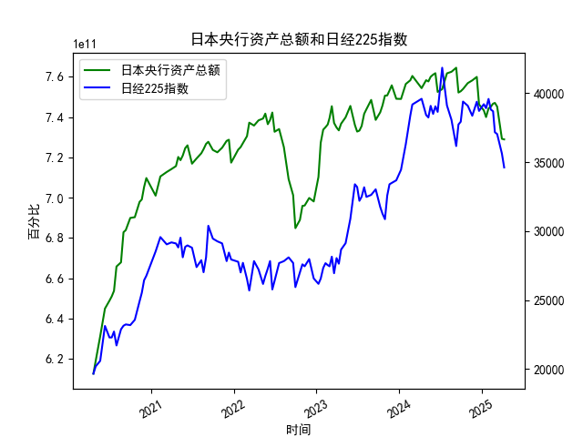

|            |   日本央行资产总额 |   日经225指数 |
|:-----------|-------------------:|--------------:|
| 2024-07-10 |        7.53868e+11 |       41832   |
| 2024-07-31 |        7.61714e+11 |       39101.8 |
| 2024-08-20 |        7.62497e+11 |       38062.9 |
| 2024-09-10 |        7.64503e+11 |       36159.2 |
| 2024-09-20 |        7.52201e+11 |       37723.9 |
| 2024-09-30 |        7.52847e+11 |       37919.6 |
| 2024-10-10 |        7.53936e+11 |       39380.9 |
| 2024-10-31 |        7.56864e+11 |       39081.2 |
| 2024-11-20 |        7.58232e+11 |       38352.3 |
| 2024-12-10 |        7.59957e+11 |       39367.6 |
| 2024-12-20 |        7.46306e+11 |       38701.9 |
| 2025-01-10 |        7.43361e+11 |       39190.4 |
| 2025-01-20 |        7.40022e+11 |       38902.5 |
| 2025-01-31 |        7.44346e+11 |       39572.5 |
| 2025-02-10 |        7.45188e+11 |       38801.2 |
| 2025-02-20 |        7.46669e+11 |       38678   |
| 2025-02-28 |        7.47052e+11 |       37155.5 |
| 2025-03-10 |        7.45231e+11 |       37028.3 |
| 2025-03-31 |        7.29239e+11 |       35617.6 |
| 2025-04-10 |        7.28954e+11 |       34609   |

# 日本央行资产总额与日经225指数的分析

---

## **1. 日本央行资产总额与日经225指数的相关性及影响逻辑**

### **相关性分析**
从数据趋势看，**日本央行资产总额（持续扩张）与日经225指数（长期震荡上行）呈现中度正相关性**。具体表现为：
- **货币政策传导机制**：日本央行通过量化宽松（QE）购买国债、ETF等资产，直接增加市场流动性并压低长期利率，推升股票估值。
- **市场信心提振**：央行扩表释放宽松信号，降低企业融资成本并刺激消费和投资，间接利好上市公司盈利预期。
- **ETF购买直接干预**：日本央行持有大量日股ETF（如2020年疫情期间加速购入），直接支撑日经225指数成分股价格。

### **影响逻辑**
- **正向循环**：央行扩表 → 流动性宽松 → 风险偏好上升 → 股市上涨 → 财富效应刺激经济 → 企业盈利改善。
- **反向风险**：若央行缩表或政策转向紧缩，可能导致流动性收紧、股市回调，但日本长期维持宽松基调（如YCC政策），此风险短期较低。

---

## **2. 近期投资或套利机会与策略**

### **当前数据观察**
- **央行资产趋势**：近一年资产总额在**7.3-7.6万亿日元区间波动**，显示扩表节奏边际放缓但未转向紧缩。
- **日经225指数**：近期从历史高位（42156点）回调至**34000-37000区间震荡**，反映全球流动性收紧预期（如美联储加息）的冲击。

### **潜在机会**
1. **均值回归策略**：
   - **逻辑**：日经指数短期超跌（如跌破35000点）与央行维持宽松政策背离，可逢低布局股指期货或ETF。
   - **风险**：需关注美联储政策外溢效应（日元贬值压力可能制约日股反弹空间）。

2. **央行政策套利**：
   - **逻辑**：若日本央行重申宽松立场（如扩大国债收益率波动区间但维持YCC），可能引发日元贬值、日股反弹的“弱日元-强股市”组合。
   - **策略**：做多日经225指数期货 + 做空日元汇率（如USD/JPY）。

3. **板块轮动机会**：
   - **受益行业**：出口主导型板块（如汽车、电子）因日元贬值预期存在盈利修复空间。
   - **规避领域**：高负债企业或利率敏感型行业（如公用事业）可能受长期利率波动冲击。

### **风险提示**
- **外部冲击**：全球通胀黏性、地缘冲突升级可能导致避险情绪压制风险资产。
- **政策转向风险**：日本央行若意外调整YCC政策（如提高10年期国债收益率上限），可能引发股市短期剧烈波动。

---

## **结论**
当前日经225指数的回调与日本央行仍偏宽松的立场形成阶段性背离，建议关注超跌反弹机会，并利用汇率与股指的联动性构建对冲组合。需密切跟踪日本央行货币政策会议及全球流动性环境变化。