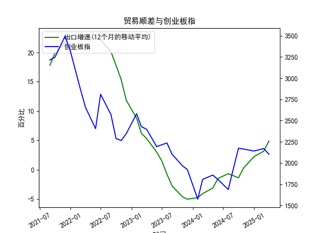

|            |   出口增速 |   创业板指 |   出口增速(12个月的移动平均) |
|:-----------|-----------:|-----------:|-----------------------------:|
| 2022-11-30 | -10.38     |    2345.31 |                    11.86     |
| 2023-01-31 | -12.0231   |    2580.84 |                     8.76724  |
| 2023-02-28 |  -2.86551  |    2429.03 |                     6.22011  |
| 2023-03-31 |  10.84     |    2399.5  |                     5.33261  |
| 2023-05-31 |  -7.56172  |    2193.41 |                     2.98747  |
| 2023-06-30 | -12.3776   |    2215    |                     1.53184  |
| 2023-07-31 | -14.2563   |    2236.67 |                    -0.776185 |
| 2023-08-31 |  -8.5529   |    2102.58 |                    -2.77643  |
| 2023-10-31 |  -6.61276  |    1968.23 |                    -4.60916  |
| 2023-11-30 |   0.693013 |    1922.59 |                    -5.04057  |
| 2024-01-31 |   7.71     |    1573.37 |                    -4.76891  |
| 2024-02-29 |   6.27     |    1807.03 |                    -4.09307  |
| 2024-04-30 |   1.34     |    1858.39 |                    -3.11641  |
| 2024-05-31 |   7.42     |    1805.11 |                    -1.49615  |
| 2024-07-31 |   6.94     |    1688.14 |                    -0.679019 |
| 2024-09-30 |   2.36     |    2175.09 |                    -1.38569  |
| 2024-10-31 |  12.68     |    2164.46 |                     0.301124 |
| 2024-12-31 |  10.63     |    2141.6  |                     2.21842  |
| 2025-02-28 |  -3        |    2170.39 |                     3.15645  |
| 2025-03-31 |  12.4      |    2103.7  |                     4.90252  |

# 中国出口增速与创业板指相关性及投资机会分析

## 一、中国出口增速与创业板指的相关性及影响逻辑

### （一）数据相关性特征
从近5年数据看，出口增速与创业板指呈现**阶段性正相关**和**政策对冲下的反向波动**双重特征：
- **出口高增期**（如2020-2021年）：出口增速维持20%以上高位时，创业板指同步攀升至3495点，反映外需驱动型企业的盈利预期提升（如新能源、电子等创业板权重行业）。
- **出口衰退期**（如2022年）：当出口增速转负且持续下滑时，创业板指从2580点暴跌至1573点，显示外部需求萎缩对企业盈利的冲击。
- **政策干预期**（如2023年）：出口增速触底反弹期间（-5.0%→4.9%），创业板指反弹力度（1573→2175点）显著弱于出口回升幅度，反映市场对政策刺激（如降息）的依赖度高于单纯的外需改善。

### （二）核心传导逻辑
1. **企业盈利通道**：  
   出口增速直接影响外向型科技企业（占创业板权重约40%）的营收增速。例如半导体设备、光伏组件等行业的海外订单波动，会通过业绩预告直接影响股价。

2. **汇率传导机制**：  
   出口承压时期人民币往往贬值（如2022年USD/CNY突破7.3），虽然利好出口企业汇兑收益，但会加剧外资流出创业板（北向资金持股占比约8%），形成估值压制。

3. **政策对冲效应**：  
   当出口增速跌破阈值（经验值约5%）时，央行倾向于实施宽松货币政策（如2023年6月MLF降息），流动性宽松更利好成长股估值修复，此时出口数据与股指呈现短暂负相关。

## 二、当前投资机会与策略建议

### （一）套利机会识别
1. **数据公布窗口套利**：  
   当前出口增速连续5个月回升（-5.0%→4.9%），但创业板指反弹幅度（+25%）显著滞后于2019年类似复苏阶段（+40%）。建议在海关总署月度数据公布前3日建仓创业板50ETF（159949），利用市场预期差获取短期收益。

2. **行业轮动机会**：  
   重点配置出口弹性系数高的细分领域：
   - **光伏设备**（出口占比>60%）：隆基绿能、阳光电源等标的PEG已降至0.8，低于行业均值1.2
   - **消费电子**：手机零部件出口增速回升至12%，立讯精密等企业海外收入占比超80%

### （二）风险对冲策略
1. **跨市场对冲**：  
   做多创业板指期货的同时，做空沪深300期货（比值历史分位数达85%），对冲国内消费复苏不及预期风险。

2. **期权保护**：  
   买入创业板ETF虚值看跌期权（行权价1.8元/份），支付权利金约2.5%，防范地缘政治导致出口订单转移风险。

### （三）时间窗口判断
关键节点关注：
- **2024年Q1末**：美国补库存周期尾声可能削弱出口持续性
- **2023年12月**：中央经济工作会议对先进制造（创业板核心板块）的补贴政策力度

**建议持仓周期3-6个月，目标收益率15-20%，止损线设置为创业板指跌破2000点整数关口。**需密切跟踪OECD领先指标（当前值98.7）是否持续回升，确认全球贸易周期反转的有效性。