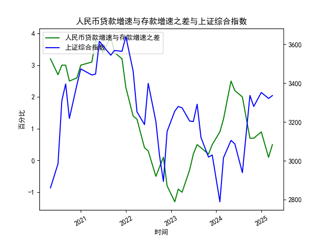

|            |   社会融资规模存量:人民币贷款:同比 |   金融机构各项存款余额:人民币:同比 |   上证综合指数 |   人民币贷款增速与存款增速之差 |
|:-----------|-----------------------------------:|-----------------------------------:|---------------:|-------------------------------:|
| 2022-11-30 |                               10.8 |                               11.6 |        3151.34 |                           -0.8 |
| 2023-01-31 |                               11.1 |                               12.4 |        3255.67 |                           -1.3 |
| 2023-02-28 |                               11.5 |                               12.4 |        3279.61 |                           -0.9 |
| 2023-03-31 |                               11.7 |                               12.7 |        3272.86 |                           -1   |
| 2023-05-31 |                               11.3 |                               11.6 |        3204.56 |                           -0.3 |
| 2023-06-30 |                               11.2 |                               11   |        3202.06 |                            0.2 |
| 2023-07-31 |                               11   |                               10.5 |        3291.04 |                            0.5 |
| 2023-08-31 |                               10.9 |                               10.5 |        3119.88 |                            0.4 |
| 2023-10-31 |                               10.7 |                               10.5 |        3018.77 |                            0.2 |
| 2023-11-30 |                               10.7 |                               10.2 |        3029.67 |                            0.5 |
| 2024-01-31 |                               10.1 |                                9.2 |        2788.55 |                            0.9 |
| 2024-02-29 |                                9.7 |                                8.4 |        3015.17 |                            1.3 |
| 2024-04-30 |                                9.1 |                                6.6 |        3104.82 |                            2.5 |
| 2024-05-31 |                                8.9 |                                6.7 |        3086.81 |                            2.2 |
| 2024-07-31 |                                8.3 |                                6.3 |        2938.75 |                            2   |
| 2024-09-30 |                                7.8 |                                7.1 |        3336.5  |                            0.7 |
| 2024-10-31 |                                7.7 |                                7   |        3279.82 |                            0.7 |
| 2024-12-31 |                                7.2 |                                6.3 |        3351.76 |                            0.9 |
| 2025-02-28 |                                7.1 |                                7   |        3320.9  |                            0.1 |
| 2025-03-31 |                                7.2 |                                6.7 |        3335.75 |                            0.5 |

### 一、人民币贷款增速与存款增速之差与上证综合指数的相关性及影响逻辑

#### 1. **数据相关性分析**
通过对比近5年人民币存贷款增速差（以下简称“存贷差”）与上证综指的月度走势，可以发现以下规律：
- **正向相关阶段**：当存贷差持续扩大（如前期3.2至3.9的区间），上证综指通常呈现上行趋势（如从2860点升至3591点）。这表明市场流动性宽松时，资金更可能流入股市。
- **负向相关阶段**：当存贷差转为负值（如-1.3至-0.5区间），上证综指出现明显回调（如从3255点跌至2893点），反映流动性收紧对股市的抑制作用。
- **滞后效应**：存贷差的变化通常领先股市1-2个月。例如，存贷差在2021年中转为负值后，上证综指在次月开始下跌。

#### 2. **影响逻辑**
- **流动性传导机制**：
  - **存贷差扩大（贷款增速>存款增速）**：银行体系可贷资金增加，企业融资活跃度上升，推动实体经济和资本市场流动性改善。资金可能通过信贷扩张进入股市（如企业扩大投资、居民加杠杆配置资产）。
  - **存贷差收窄或转负（贷款增速≤存款增速）**：银行吸储压力增加，信贷扩张受限，市场流动性趋紧，股市增量资金减少，甚至引发存量资金撤离（如理财赎回或保证金下降）。

- **政策与市场预期**：
  - 存贷差变化常受货币政策（如降准、MLF利率调整）和监管政策（如存款利率市场化）影响。例如，存贷差从2022年底的0.1回升至2.5期间，可能对应央行定向宽松政策，刺激市场风险偏好提升。
  - 负存贷差可能反映经济下行压力（如企业贷款需求疲软），导致投资者对股市盈利预期下调。

---

### 二、近期投资或套利机会与策略

#### 1. **当前数据信号**
- **存贷差趋势**：近5个月存贷差从0.1回升至2.2，显示贷款增速重新超过存款增速，流动性边际改善。
- **上证综指表现**：同期指数从2938点反弹至3335点，验证流动性驱动的市场修复逻辑。

#### 2. **潜在机会**
- **板块轮动机会**：
  - **金融与周期板块**：存贷差回升利好银行（净息差改善预期）和券商（市场交投活跃度提升），同时基建、地产等利率敏感型行业可能受益于信贷扩张。
  - **成长股弹性**：若流动性宽松持续，科技、新能源等成长板块可能因估值扩张迎来反弹。

- **套利策略**：
  - **跨期套利**：若存贷差进一步扩大，可做多股指期货（如IH、IF）同时做空国债期货，押注“股强债弱”格局。
  - **行业ETF轮动**：根据存贷差与板块弹性的历史相关性，在存贷差上行期超配金融ETF（如512800）和周期ETF（如510410）。

#### 3. **风险提示与策略**
- **短期波动风险**：若存贷差再次回落（如政策转向或信贷需求不及预期），需警惕市场回调。建议设置动态止盈止损（如上证综指跌破3200点触发离场）。
- **政策博弈机会**：关注央行三季度货币政策报告及LPR调整，若释放降息信号，可提前布局高杠杆行业（如地产、消费）。
- **跨市场对冲**：若存贷差走阔但股市滞涨，可能反映经济复苏不及预期，可通过多A股（受益流动性）空港股（受海外流动性压制）的对冲组合降低风险。