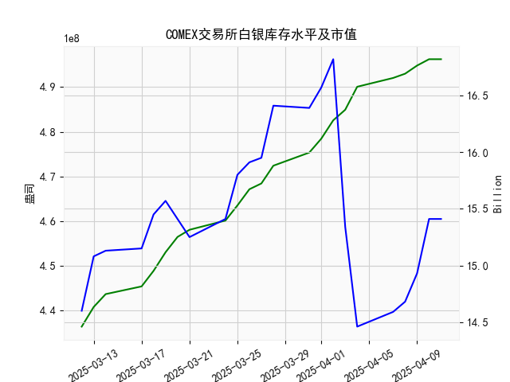

|            |   comex白银库存量 |   comex白银库存市值(billion) |   伦敦银现货价 |   上海金交所白银现货价 |   美元兑人民币汇率 |
|:-----------|------------------:|-----------------------------:|---------------:|-----------------------:|-------------------:|
| 2025-03-12 |       4.3643e+08  |                       33.445 |         33.03  |                   8078 |             7.1696 |
| 2025-03-13 |       4.40821e+08 |                       34.2   |         33.15  |                   8140 |             7.1728 |
| 2025-03-14 |       4.43699e+08 |                       34.11  |         33.895 |                   8348 |             7.1738 |
| 2025-03-17 |       4.45423e+08 |                       34.015 |         33.77  |                   8325 |             7.1688 |
| 2025-03-18 |       4.48907e+08 |                       34.415 |         34.085 |                   8345 |             7.1733 |
| 2025-03-19 |       4.53064e+08 |                       34.37  |         33.92  |                   8353 |             7.1697 |
| 2025-03-20 |       4.56486e+08 |                       33.75  |         33.31  |                   8317 |             7.1754 |
| 2025-03-21 |       4.58087e+08 |                       33.29  |         33.18  |                   8190 |             7.176  |
| 2025-03-24 |       4.60151e+08 |                       33.48  |         33.085 |                   8224 |             7.178  |
| 2025-03-25 |       4.63534e+08 |                       34.09  |         33.435 |                   8219 |             7.1788 |
| 2025-03-26 |       4.67153e+08 |                       34.055 |         33.76  |                   8334 |             7.1754 |
| 2025-03-27 |       4.68447e+08 |                       34.055 |         34.11  |                   8348 |             7.1763 |
| 2025-03-28 |       4.7242e+08  |                       34.745 |         34.395 |                   8483 |             7.1752 |
| 2025-03-31 |       4.75358e+08 |                       34.48  |         34.055 |                   8485 |             7.1782 |
| 2025-04-01 |       4.78458e+08 |                       34.625 |         33.97  |                   8414 |             7.1775 |
| 2025-04-02 |       4.8257e+08  |                       34.855 |         33.87  |                   8386 |             7.1793 |
| 2025-04-03 |       4.84931e+08 |                       31.625 |         32.475 |                   8263 |             7.1889 |
| 2025-04-04 |       4.90077e+08 |                       29.515 |         31.34  |                   8263 |             7.1889 |
| 2025-04-07 |       4.92042e+08 |                       29.65  |         30.325 |                   7606 |             7.198  |
| 2025-04-08 |       4.92994e+08 |                       29.775 |         30.315 |                   7689 |             7.2038 |
| 2025-04-09 |       4.94816e+08 |                       30.17  |         30.18  |                   7746 |             7.2066 |
| 2025-04-10 |       4.96236e+08 |                       31.05  |         30.925 |                   7939 |             7.2092 |
| 2025-04-11 |       4.96236e+08 |                       31.05  |         30.925 |                   7939 |             7.2087 |

### 近期白银市场套利机会与策略分析

#### 1. **库存与价格背离：跨市场套利机会**
   - **COMEX库存与伦敦现货价格矛盾**  
     最近一周（4月4日至4月11日），COMEX白银库存持续攀升（从4.90亿增至4.96亿盎司），但伦敦白银现货价格从31.34美元反弹至30.93美元（跌幅收窄），**库存增加未完全压制价格**。这可能反映市场对实物白银的短期需求回升，或存在交割仓单的投机性囤积行为。  
     **策略建议**：关注库存增速与价格波动的动态关系，若库存继续增长但价格企稳，可尝试在伦敦市场逢低买入现货，同时在COMEX期货市场对冲库存风险。

   - **上海与伦敦价差套利窗口**  
     上海金交所白银现货价格（7939元/千克）与伦敦价格（30.93美元/盎司）的汇率折算价存在显著差异：  
     - 伦敦价格（按美元兑人民币7.2087）折合约 **7168元/千克**（30.93美元×7.2087×32.15盎司/千克），低于上海价格约 **771元/千克**。  
     **策略建议**：通过进口伦敦白银并在上海市场卖出，赚取价差。但需考虑增值税（13%）及物流成本（约200-300元/吨），当前价差仍覆盖成本，套利可行性较高。

#### 2. **库存市值与现货价格的背离**
   - **COMEX库存市值异动**  
     4月3日至4月4日，库存市值从15.34亿骤降至14.46亿，同期伦敦银价下跌（32.48→31.34美元），但随后市值反弹（4月11日回升至15.41亿），**市值修复速度快于价格回升**。这可能反映市场对仓单价值的重估，或存在机构借低吸仓行为。  
     **策略建议**：短期关注市值与价格的同步性，若市值持续回升而价格滞涨，可能预示库存流动性收紧，可尝试在COMEX期货市场建立多头头寸。

#### 3. **汇率波动对跨市场套利的影响**
   - **人民币贬值放大套利空间**  
     美元兑人民币汇率从7.1889（4月4日）升至7.2087（4月11日），人民币贬值0.28%，进一步扩大上海与伦敦白银的折算价差。  
     **策略建议**：在人民币贬值预期下，优先锁定进口套利（伦敦→上海）的汇率敞口，利用远期合约或期权对冲汇率风险。

#### 4. **近期仓单变化的短期信号**
   - **库存增速放缓与价格反弹的共振**  
     最近一周（4月7日至11日），COMEX库存增幅趋缓（日均增0.6% vs 此前1%），而伦敦和上海银价同步反弹（伦敦+2.0%，上海+4.4%）。**库存边际下降或触发短期逼空行情**。  
     **策略建议**：在库存增速拐点确认后，可短线参与多单，但需警惕高库存背景下反弹的持续性。

---

### 综合建议
- **跨市场套利**：优先执行上海-伦敦进口套利，需快速执行以避免价差收敛（如人民币升值或库存流动性改善）。  
- **库存博弈策略**：若COMEX库存增速持续放缓，可轻仓布局多单，目标价为伦敦34美元/盎司（对应上海8400元/千克）。  
- **风险提示**：高库存压制长期价格上限，套利需关注交割规则（如COMEX仓单品质与上海标准差异）及政策风险（如进出口税调整）。  

**短期重点关注**：4月11日后库存是否出现拐点，以及美元兑人民币汇率是否突破7.21关口。