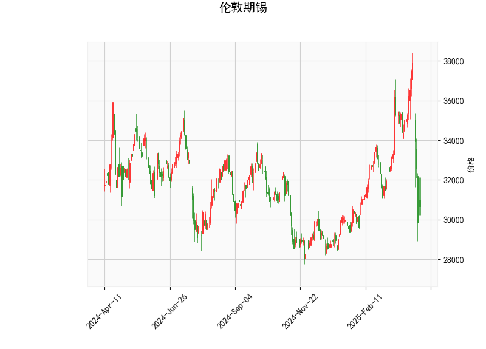

# 伦敦期锡技术分析与投资策略

## 一、技术指标分析

### 1. 价格与布林轨道
- **当前价30658**处于布林带下轨（28445）和中轨（32850）之间，低于中轨约6.7%，显示短期处于弱势区间。
- 距离下轨仅7.4%空间，而距离上轨（37255）空间高达21.5%，**价格接近超卖区域**，但尚未突破下轨支撑。

### 2. RSI指标
- **RSI值35.98**接近超卖阈值（30），显示市场抛压较大，但存在技术性反弹可能。

### 3. MACD指标
- **MACD线（-386）远低于信号线（414）**，柱状图深度负值（-800）表明**空头动能强劲**，短期下行趋势明确。
- 需关注MACD线与信号线的收敛迹象，若出现金叉可能预示反转。

### 4. K线形态
- **CDLMATCHINGLOW**：典型底部反转形态，需配合成交量确认。
- **CDLSPINNINGTOP**：纺锤线显示多空博弈激烈，短期可能进入震荡。

---

## 二、投资机会与策略建议

### 1. 短期交易机会
**▶ 超跌反弹策略**  
- **入场条件**：价格站稳布林下轨（28445）+ RSI回升至40以上  
- **目标位**：中轨32850（+7.2%），突破后上看上轨37255（+21.5%）  
- **止损位**：下轨下方2%（约27800）  

**▶ 趋势跟踪策略**  
- **突破追空**：若价格有效跌破下轨，可顺势做空  
- **目标位**：根据ATR指标测算，理论下行空间约2000点  
- **风险控制**：严格设置3%回撤止损  

### 2. 套利机会
**▶ 跨期套利**  
- 关注近月合约超卖后的**正向套利**（买近月/空远月）  
- 需结合库存周期和交割成本分析  

**▶ 波动率套利**  
- 布林带带宽达8810点（上轨-下轨），隐含波动率处于高位  
- 可考虑**卖出宽跨式期权组合**，赚取波动率回归收益  

---

## 三、风险提示
1. **MACD空头信号强烈**：当前MACD柱状图创阶段新低，需防范趋势延续风险  
2. **基本面配合度**：需同步关注LME锡库存变化（当前约4785吨）及缅甸矿供应扰动  
3. **美元指数影响**：锡价与美元指数负相关性达-0.82，警惕美联储政策转向冲击  

> （注：以上分析基于技术指标推导，实际交易需结合实时行情与资金管理）