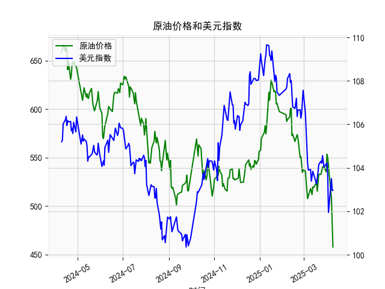

|            |   原油价格 |   美元指数 |
|:-----------|-----------:|-----------:|
| 2025-03-12 |    511.813 |    103.587 |
| 2025-03-13 |    519.681 |    103.836 |
| 2025-03-14 |    518.827 |    103.736 |
| 2025-03-17 |    522.677 |    103.399 |
| 2025-03-18 |    524.472 |    103.254 |
| 2025-03-19 |    515.257 |    103.463 |
| 2025-03-20 |    525.342 |    103.817 |
| 2025-03-21 |    532.653 |    104.154 |
| 2025-03-24 |    532.727 |    104.307 |
| 2025-03-25 |    536.903 |    104.21  |
| 2025-03-26 |    540.284 |    104.559 |
| 2025-03-27 |    538.701 |    104.26  |
| 2025-03-28 |    540.441 |    104.034 |
| 2025-03-31 |    535.328 |    104.192 |
| 2025-04-01 |    553.476 |    104.226 |
| 2025-04-02 |    550.01  |    103.661 |
| 2025-04-03 |    540.227 |    101.945 |
| 2025-04-07 |    507.76  |    103.501 |
| 2025-04-08 |    478.366 |    102.956 |
| 2025-04-09 |    457.531 |    102.971 |

### 原油价格与美元指数的相关性及影响逻辑

#### 1. 相关性分析
原油价格与美元指数通常呈现**负相关关系**，核心逻辑如下：
- **计价货币效应**：原油以美元计价，美元走强时，其他货币购买原油的成本上升，可能抑制需求，从而压低油价；反之，美元走弱会降低非美元国家的进口成本，刺激需求并推高油价。
- **避险与通胀关联**：美元作为全球避险资产，在风险偏好下降时往往走强，而经济不确定性可能导致原油需求预期下降（如2022年美联储加息周期中美元与油价的同步波动）。同时，美元贬值可能引发通胀预期，促使投资者买入原油对冲通胀。
- **例外情景**：当供需矛盾主导市场时（如地缘冲突导致供应中断），油价可能与美元同步上涨，但长期负相关性仍是主要规律。

#### 2. 近期投资或套利机会分析

##### 数据观察
- **原油价格**：从近期低点457.5反弹至574附近，随后震荡上行，但波动率较高（如单日涨幅达5%以上）。
- **美元指数**：从109高位回落至102-103区间，近期在104-107间震荡，显示美联储加息预期放缓的影响。

##### 潜在机会
1. **趋势性策略**：
   - **做多原油**：若美元指数延续弱势（如跌破104），叠加夏季出行旺季需求回升，可逢低布局原油多头。需关注OPEC+减产执行度及库存数据。
   - **对冲组合**：做多原油期货（如Brent）同时做空美元指数期货（DXY），捕捉两者负相关性扩大的机会。

2. **套利策略**：
   - **跨期套利**：近期原油期货呈现Backwardation（近月合约价格高于远月），可做多近月合约、做空远月合约，赚取展期收益。
   - **裂解价差交易**：炼厂利润（Crack Spread）随需求回升可能扩大，可做多汽油/取暖油期货、做空原油期货。

3. **事件驱动机会**：
   - **地缘风险溢价**：关注中东局势、俄罗斯出口政策变化，若供应扰动升级，可短期做多油价波动率（如买入看涨期权）。
   - **美联储政策转向**：若下半年降息预期强化导致美元进一步走弱，可提前布局原油多头。

##### 风险提示
- **需求不及预期**：全球经济衰退风险或中国复苏放缓可能压制油价。
- **美元反弹**：若美国通胀数据超预期，美元可能再度走强，压制原油上行空间。
- **政策干预**：美国可能释放战略储备或施压OPEC增产以平抑油价。

#### 结论
当前美元指数处于震荡区间，原油价格则处于反弹通道，建议采用**波段操作+事件驱动结合**的策略，重点关注美元指数105关键支撑位和原油580-600阻力区间的突破信号。