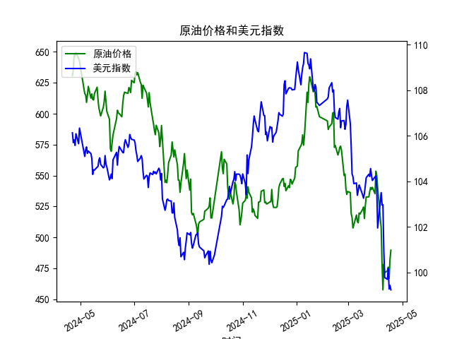

|            |   原油价格 |   美元指数 |
|:-----------|-----------:|-----------:|
| 2025-03-21 |    532.653 |   104.154  |
| 2025-03-24 |    532.727 |   104.307  |
| 2025-03-25 |    536.903 |   104.21   |
| 2025-03-26 |    540.284 |   104.559  |
| 2025-03-27 |    538.701 |   104.26   |
| 2025-03-28 |    540.441 |   104.034  |
| 2025-03-31 |    535.328 |   104.192  |
| 2025-04-01 |    553.476 |   104.226  |
| 2025-04-02 |    550.01  |   103.661  |
| 2025-04-03 |    540.227 |   101.945  |
| 2025-04-07 |    507.76  |   103.501  |
| 2025-04-08 |    478.366 |   102.956  |
| 2025-04-09 |    457.531 |   102.971  |
| 2025-04-10 |    478.419 |   100.937  |
| 2025-04-11 |    471.486 |    99.769  |
| 2025-04-14 |    472.798 |    99.692  |
| 2025-04-15 |    475.87  |   100.167  |
| 2025-04-16 |    466.823 |    99.2667 |
| 2025-04-17 |    482.036 |    99.424  |
| 2025-04-18 |    489.603 |    99.2286 |

## 原油价格和美元指数的相关性及影响逻辑

### 1. 相关性分析
原油价格和美元指数之间通常存在反向关系。这种负相关性源于以下几个原因：
- **计价货币因素**：原油在国际市场上以美元计价，当美元走强时，对于持有其他货币的国家而言，相对购买原油的成本会上升，可能抑制需求，从而导致原油价格下跌。
- **市场预期和全球经济状况**：美元指数走强往往反映了投资者对美国经济和货币政策的信心增强，对全球其他经济体的相对弱势的看法，这可能导致资本流入美元资产，压制大宗商品价格，包括原油。

### 2. 影响逻辑
根据数据，近一年原油价格总体呈现下降趋势，而美元指数也有一定程度的减弱。通常情况下，若美元指数下降，原油价格有上升的倾向，因为持有其他货币的成本相对降低。然而，此期间原油价格的下降可能受到供需关系变化、地缘政治因素或经济预期调整等影响。

## 近期可能存在的投资或套利机会和策略

### 1. 投资机会
- **多元化投资组合**：由于原油价格下降，可能进入较低的价格区间。投资者可以考虑在低位进行买入，以持有原油期货或相关能源类基金，预计中长期可能会有所反弹。
- **货币对冲**：随着美元指数下行，投资者可能考虑增加非美货币资产的配置，降低汇率风险，如欧元或日元资产。

### 2. 套利策略
- **跨市场套利**：针对美元指数与原油价格变化的错配，投资者可以设计套利策略，例如做空美国股票市场的原油相关企业同时做多美国中型企业以平衡风险。
- **商品与外汇市场结合**：使用期权和期货合约，结合美元指数和原油价格走势进行套期保值。例如，原油价格可能继续下滑，而美元指数走稳时，同时做空原油与买入看涨美元期权，进行风险对冲。

### 总结
原油和美元指数的联动关系复杂多变，投资者应结合宏观经济、政策变动以及市场供需状况等多因素，灵活运用多种金融工具和策略进行分析投资。合理的风险管理和市场预判是成功投资的关键。